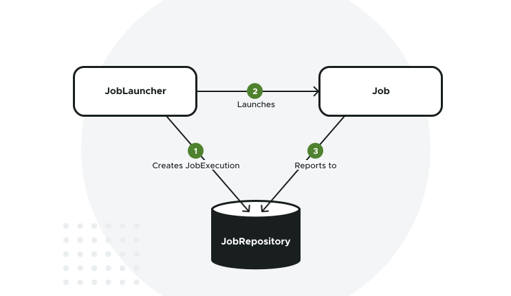

# MODULE 1: Create, run and test your Job

## Entendiendo los Jobs y cómo ejecutarlos

En la lección anterior, aprendió que un `job` es una entidad que encapsula un proceso por lotes completo que se ejecuta
de principio a fin sin interacción ni interrupción. En esta lección, aprenderá cómo se representan internamente
los `jobs` en Spring Batch, cómo se lanzan y cómo se conservan sus metadatos de ejecución.

## ¿Qué es un Job?

Un `job` es una entidad que encapsula todo un proceso por lotes que se ejecuta de principio a fin. Consiste en un
conjunto de pasos que se ejecutan en un orden específico. Cubriremos los pasos en una lección futura. Aquí nos
centraremos en qué es un `job` y cómo se representa en Spring Batch.

Un `job` por lotes en Spring Batch está representado por la interfaz `Job` proporcionada por la dependencia
`spring-batch-core`:

````java
public interface Job {
    String getName();

    void execute(JobExecution execution);
}
````

En un nivel fundamental, la interfaz `Job` requiere que las implementaciones especifiquen el nombre del Job (el método
`getName()`) y lo que se supone que debe hacer el Job (el método `execute(JobExecution execution)`).

El método `execute` da una referencia a un objeto `JobExecution`. El objeto `JobExecution` **representa la ejecución
real del `Job` en tiempo de ejecución. Contiene una serie de detalles en tiempo de ejecución, como la hora de inicio,
la hora de finalización, el estado de ejecución, etc.** Esta información de tiempo de ejecución es almacenada por Spring
Batch en un repositorio de metadatos, que veremos en la siguiente sección.

Observe que no se espera que el método `execute` lance ninguna excepción. Las excepciones en tiempo de ejecución
deben ser gestionadas por las implementaciones, y añadidas en el objeto `JobExecution`. Los clientes deben inspeccionar
el estado de `JobExecution` para determinar el éxito o el fracaso.

## Entendiendo los metadatos del Job

Uno de los conceptos clave en Spring Batch es el `JobRepository`. El `JobRepository` es donde se almacenan todos los
metadatos sobre `jobs` y `steps`. Un `JobRepository` puede ser un almacén persistente o un almacén en memoria. Un
almacén persistente tiene la ventaja de proporcionar metadatos incluso después de que un `job` haya terminado, lo que
podría ser utilizado para el análisis posterior o para reiniciar un `job` en el caso de un fallo. Cubriremos la
posibilidad de reiniciar un `Job` en una lección posterior.

Spring Batch proporciona una implementación `JDBC` del `JobRepository`, que almacena metadatos de lotes en una base de
datos relacional. En un sistema de producción, deberá crear algunas tablas que Spring Batch utilizará para almacenar sus
metadatos de ejecución. Ya hemos tratado las tablas de metadatos en el Laboratorio anterior.

El `JobRepository` es lo que crea un objeto `JobExecution` cuando se lanza un trabajo por primera vez. Pero, **¿cómo se
lanzan los Trabajos?** Veámoslo en la siguiente sección.

## Lanzando Jobs

El lanzamiento de `jobs` en Spring Batch se realiza a través del concepto `JobLauncher`, representado por la siguiente
interfaz:

````java
public interface JobLauncher {
    JobExecution run(Job job, JobParameters jobParameters) throws
            JobExecutionAlreadyRunningException,
            JobRestartException,
            JobInstanceAlreadyCompleteException,
            JobParametersInvalidException;
}
````

El método `run` está diseñado para lanzar un `Job` dado con un conjunto de JobParameters. Cubriremos los parámetros del
`job` en detalle en una lección posterior. Por ahora, puedes pensar en ellos como una colección de pares clave/valor
que son pasados al `Job` en tiempo de ejecución. Hay dos aspectos importantes a entender aquí:

- Se espera que las implementaciones de la interfaz `JobLauncher` obtengan un `JobExecution` válido del `JobRepository`
  y ejecuten el `Job`.
- El método `run` lanza diferentes tipos de excepciones. Cubriremos todas estas excepciones en detalle durante el curso.

Casi nunca tendrá que implementar la interfaz `JobLauncher` usted mismo, porque Spring Batch proporciona una
implementación lista para usar. El siguiente diagrama muestra cómo el `JobLauncher`, el `JobRepository` y el `Job`
interactúan entre sí.



Los trabajos por lotes se lanzan normalmente de dos maneras:

- Desde la interfaz de línea de comandos.
- Desde un contenedor web.

**En este curso, sólo cubriremos el lanzamiento de `Jobs` desde la línea de comandos.** Por favor, consulte los
enlaces de recursos adicionales para más detalles sobre cómo lanzar trabajos desde dentro de un contenedor web.