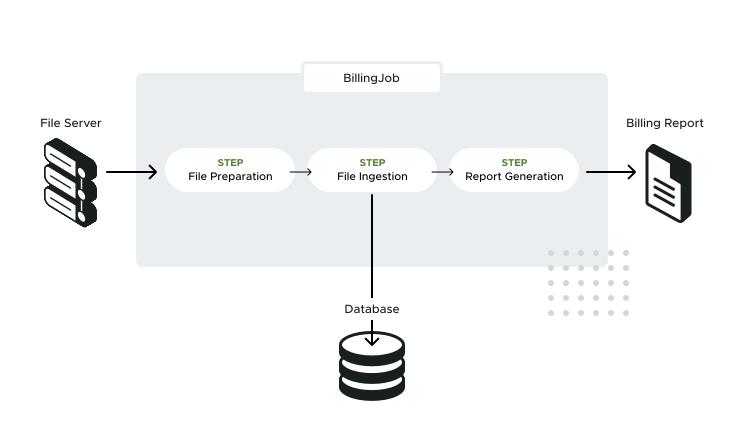
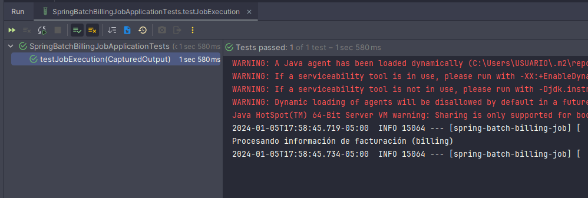
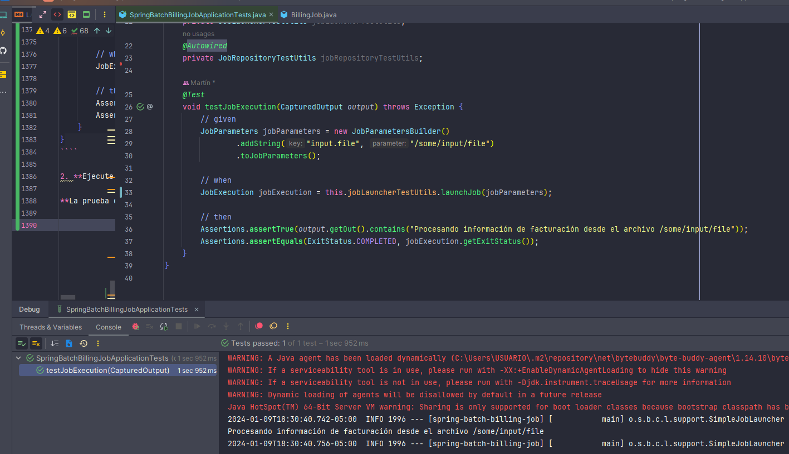
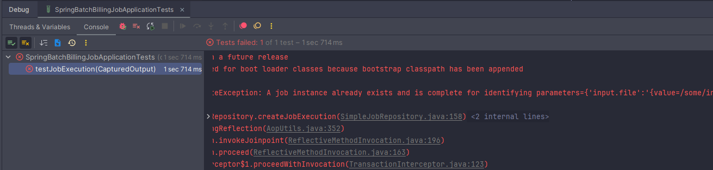

# LABORATORIO

---

## ¿Qué vamos a construir?

Creará una aplicación por lotes que genera informes de facturación para una empresa de telefonía móvil imaginaria
llamada Spring Cellular. La aplicación almacena la información de facturación en una base de datos relacional y genera
un informe de facturación. Esta aplicación se basa en Spring Boot y utiliza las características de Spring Batch para
crear un sistema de procesamiento por lotes robusto que se puede reiniciar y es tolerante a fallos.

Implementará un `Job` por lotes denominado `BillingJob` que está diseñado de la siguiente manera:



El trabajo de facturación se estructura en los siguientes pasos:

- **Paso de preparación del archivo:** copia el archivo que contiene el consumo mensual de los clientes de Spring
  Cellular de un servidor de archivos a un área de preparación.

- **Paso de ingestión del archivo:** ingiere el archivo en una tabla de base de datos relacional que contiene los datos
  utilizados para generar el informe de facturación.

- **Paso de generación del informe:** procesa la información de facturación de la tabla de la base de datos y genera un
  archivo plano que contiene los datos de los clientes que han gastado más de 150,00 USD.

## Dependencias

Para la creación de este proyecto se utilizó la dependencia de `Spring Batch` y el Driver de `PostgreSQL`:

````xml
<!--Spring Boot 3.2.1-->
<!--Java 21-->
<dependencies>
    <dependency>
        <groupId>org.springframework.boot</groupId>
        <artifactId>spring-boot-starter-batch</artifactId>
    </dependency>

    <dependency>
        <groupId>org.postgresql</groupId>
        <artifactId>postgresql</artifactId>
        <scope>runtime</scope>
    </dependency>
    <dependency>
        <groupId>org.springframework.boot</groupId>
        <artifactId>spring-boot-starter-test</artifactId>
        <scope>test</scope>
    </dependency>
    <dependency>
        <groupId>org.springframework.batch</groupId>
        <artifactId>spring-batch-test</artifactId>
        <scope>test</scope>
    </dependency>
</dependencies>
````

## Preparar el proyecto para Spring Batch

Creamos una clase de configuración para nuestro batch de **facturación (Billing)**, donde más adelante definiremos los
beans relacionados con Spring Batch (Jobs, Steps, etc):

````java

@Configuration
public class BillingJobConfig {
}
````

## Configurando base de datos

### 1. Preparar la base de datos con las tablas de metadatos de Spring Batch

En esta sección, creará las tablas de metadatos de Spring Batch en la base de datos. Esta es la única vez que tendrá que
hacerlo a efectos de aprendizaje.

Primero, crearemos una base de datos contenerizada de Postgres, para eso en la raíz del proyecto creamos el
archivo `compose.yml` y agregamos la siguiente configuración:

````yml
services:
  postgres:
    container_name: postgres
    image: postgres:15.2-alpine
    restart: unless-stopped
    environment:
      POSTGRES_DB: db_spring_batch
      POSTGRES_USER: magadiflo
      POSTGRES_PASSWORD: magadiflo
    ports:
      - 5433:5432
    expose:
      - 5433
````

Ahora, ejecutamos el comando de docker compose para levantar el contenedor de nuestra base de datos y a continuación
verificamos que esté ejecutándose:

````bash
M:\PROGRAMACION\DESARROLLO_JAVA_SPRING\11.spring_academy\spring-batch-billing-job (main -> origin
$ docker compose up -d
[+] Building 0.0s (0/0)
[+] Running 2/2
✔ Network spring-batch-billing-job_default  Created
✔ Container postgres                        Started

$ docker container ls -a
CONTAINER ID   IMAGE                  COMMAND                  CREATED         STATUS         PORTS                              NAMES
a681802663c0   postgres:15.2-alpine   "docker-entrypoint.s…"   3 minutes ago   Up 3 minutes   5433/tcp, 0.0.0.0:5433->5432/tcp   postgres
````

Podemos utilizar `DBeaver` para conectarnos a la base de datos de postgres dentro del contenedor y ejecutar directamente
el script que contiene las tablas y secuencias para definir nuestra base de datos, pero, en mi caso crearé
un `Script de Shell` donde definiré los comandos a utilizar para poder eliminar y crear las tablas desde cero. Para eso,
en la raíz del proyecto crearé un directorio llamado `/scripts` donde agregaré el archivo
llamado `drop-create-tables-database.sh` y definiré los siguientes comandos:

````bash
docker cp ./src/sql/schema-drop-tables.sql postgres:/tmp/
docker cp ./src/sql/schema-create-tables.sql postgres:/tmp/

docker exec postgres psql -f ./tmp/schema-drop-tables.sql -U magadiflo -d db_spring_batch
docker exec postgres psql -f ./tmp/schema-create-tables.sql -U magadiflo -d db_spring_batch
````

**DONDE**

- `docker cp`, comando de docker que permite copiar archivos desde la pc local hacia dentro del contenedor y viceversa.
- `./src/sql/schema-drop-tables.sql`, archivo que estará en dicha ruta de mi pc local para ser copiada.
- `postgres:/tmp/`, `postgres` es el nombre del contenedor y `/tmp/` el directorio de destino dentro del contenedor
  donde copiaremos el archivo.

- `docker exec postgres`, accedemos dentro del contenedor `postgres`.
- `psql`, nos permite utilizar la línea de comandos de postgres dentro del contenedor.
- `-f ./tmp/schema-drop-tables.sql`, utilizará el archivo ubicado en dicho path. Recordemos que dicho archivo lo
  copiamos al inicio.
- `-U magadiflo`, definimos el usuario de la base de datos que es `magadiflo`.
- `-d db_spring_batch`, definimos la base de datos que usaremos.

Ahora, observamos que en los comandos anteriores estamos usando unos archivos que hasta el momento no hemos definido:
`schema-drop-tables.sql` y `schema-create-tables.sql`, así que para que esto funcione debemos crear dichos archivos
en el directorio `/src/sql/`:

`schema-drop-tables.sql`

````sql
DROP TABLE IF EXISTS BATCH_STEP_EXECUTION_CONTEXT;
DROP TABLE IF EXISTS BATCH_JOB_EXECUTION_CONTEXT;
DROP TABLE IF EXISTS BATCH_STEP_EXECUTION;
DROP TABLE IF EXISTS BATCH_JOB_EXECUTION_PARAMS;
DROP TABLE IF EXISTS BATCH_JOB_EXECUTION;
DROP TABLE IF EXISTS BATCH_JOB_INSTANCE;

DROP SEQUENCE IF EXISTS BATCH_STEP_EXECUTION_SEQ;
DROP SEQUENCE IF EXISTS BATCH_JOB_EXECUTION_SEQ;
DROP SEQUENCE IF EXISTS BATCH_JOB_SEQ;
````

`schema-create-tables.sql`

````sql
CREATE TABLE BATCH_JOB_INSTANCE (
    JOB_INSTANCE_ID BIGINT  NOT NULL PRIMARY KEY ,
    VERSION BIGINT ,
    JOB_NAME VARCHAR(100) NOT NULL,
    JOB_KEY VARCHAR(32) NOT NULL,
    constraint JOB_INST_UN unique (JOB_NAME, JOB_KEY)
);

CREATE TABLE BATCH_JOB_EXECUTION (
    JOB_EXECUTION_ID BIGINT  NOT NULL PRIMARY KEY ,
    VERSION BIGINT  ,
    JOB_INSTANCE_ID BIGINT NOT NULL,
    CREATE_TIME TIMESTAMP NOT NULL,
    START_TIME TIMESTAMP DEFAULT NULL ,
    END_TIME TIMESTAMP DEFAULT NULL ,
    STATUS VARCHAR(10) ,
    EXIT_CODE VARCHAR(2500) ,
    EXIT_MESSAGE VARCHAR(2500) ,
    LAST_UPDATED TIMESTAMP,
    constraint JOB_INST_EXEC_FK foreign key (JOB_INSTANCE_ID)
      references BATCH_JOB_INSTANCE(JOB_INSTANCE_ID)
);

CREATE TABLE BATCH_JOB_EXECUTION_PARAMS (
    JOB_EXECUTION_ID BIGINT NOT NULL ,
    PARAMETER_NAME VARCHAR(100) NOT NULL ,
    PARAMETER_TYPE VARCHAR(100) NOT NULL ,
    PARAMETER_VALUE VARCHAR(2500) ,
    IDENTIFYING CHAR(1) NOT NULL ,
    constraint JOB_EXEC_PARAMS_FK foreign key (JOB_EXECUTION_ID)
     references BATCH_JOB_EXECUTION(JOB_EXECUTION_ID)
);

CREATE TABLE BATCH_STEP_EXECUTION (
    STEP_EXECUTION_ID BIGINT  NOT NULL PRIMARY KEY ,
    VERSION BIGINT NOT NULL,
    STEP_NAME VARCHAR(100) NOT NULL,
    JOB_EXECUTION_ID BIGINT NOT NULL,
    CREATE_TIME TIMESTAMP NOT NULL,
    START_TIME TIMESTAMP DEFAULT NULL ,
    END_TIME TIMESTAMP DEFAULT NULL ,
    STATUS VARCHAR(10) ,
    COMMIT_COUNT BIGINT ,
    READ_COUNT BIGINT ,
    FILTER_COUNT BIGINT ,
    WRITE_COUNT BIGINT ,
    READ_SKIP_COUNT BIGINT ,
    WRITE_SKIP_COUNT BIGINT ,
    PROCESS_SKIP_COUNT BIGINT ,
    ROLLBACK_COUNT BIGINT ,
    EXIT_CODE VARCHAR(2500) ,
    EXIT_MESSAGE VARCHAR(2500) ,
    LAST_UPDATED TIMESTAMP,
    constraint JOB_EXEC_STEP_FK foreign key (JOB_EXECUTION_ID)
       references BATCH_JOB_EXECUTION(JOB_EXECUTION_ID)
);

CREATE TABLE BATCH_STEP_EXECUTION_CONTEXT (
    STEP_EXECUTION_ID BIGINT NOT NULL PRIMARY KEY,
    SHORT_CONTEXT VARCHAR(2500) NOT NULL,
    SERIALIZED_CONTEXT TEXT ,
    constraint STEP_EXEC_CTX_FK foreign key (STEP_EXECUTION_ID)
       references BATCH_STEP_EXECUTION(STEP_EXECUTION_ID)
);

CREATE TABLE BATCH_JOB_EXECUTION_CONTEXT (
    JOB_EXECUTION_ID BIGINT NOT NULL PRIMARY KEY,
    SHORT_CONTEXT VARCHAR(2500) NOT NULL,
    SERIALIZED_CONTEXT TEXT ,
    constraint JOB_EXEC_CTX_FK foreign key (JOB_EXECUTION_ID)
      references BATCH_JOB_EXECUTION(JOB_EXECUTION_ID)
);

CREATE SEQUENCE BATCH_STEP_EXECUTION_SEQ MAXVALUE 9223372036854775807 NO CYCLE;
CREATE SEQUENCE BATCH_JOB_EXECUTION_SEQ MAXVALUE 9223372036854775807 NO CYCLE;
CREATE SEQUENCE BATCH_JOB_SEQ MAXVALUE 9223372036854775807 NO CYCLE;
````

Una vez que tenemos creado el archivo `Script de Shell` y los `Scripts SQL` y además tenemos corriendo el contenedor
de postgres, utilizamos el `GitBash` para ejecutar el archivo `drop-create-tables-database.sh`, así que nos posicionamos
en la raíz del proyecto y ejecutamos:

````bash
# Utilizando GitBash
USUARIO@DESKTOP-EGDL8Q6 MINGW64 /m/PROGRAMACION/DESARROLLO_JAVA_SPRING/11.spring_academy/spring-batch-billing-job (feature/create-run-test-job)

$ ./scripts/drop-create-tables-database.sh
psql:tmp/schema-drop-tables.sql:1: NOTICE:  table "batch_step_execution_context" does not exist, skipping
DROP TABLE
DROP TABLE
psql:tmp/schema-drop-tables.sql:2: NOTICE:  table "batch_job_execution_context" does not exist, skipping
psql:tmp/schema-drop-tables.sql:3: NOTICE:  table "batch_step_execution" does not exist, skipping
DROP TABLE
psql:tmp/schema-drop-tables.sql:4: NOTICE:  table "batch_job_execution_params" does not exist, skipping
DROP TABLE
psql:tmp/schema-drop-tables.sql:5: NOTICE:  table "batch_job_execution" does not exist, skipping
DROP TABLE
DROP TABLE
psql:tmp/schema-drop-tables.sql:6: NOTICE:  table "batch_job_instance" does not exist, skipping
psql:tmp/schema-drop-tables.sql:8: NOTICE:  sequence "batch_step_execution_seq" does not exist, skipping
DROP SEQUENCE
psql:tmp/schema-drop-tables.sql:9: NOTICE:  sequence "batch_job_execution_seq" does not exist, skipping
DROP SEQUENCE
psql:tmp/schema-drop-tables.sql:10: NOTICE:  sequence "batch_job_seq" does not exist, skipping
DROP SEQUENCE
CREATE TABLE
CREATE TABLE
CREATE TABLE
CREATE TABLE
CREATE TABLE
CREATE TABLE
CREATE SEQUENCE
CREATE SEQUENCE
CREATE SEQUENCE
````

La primera vez nos saldrá el mensaje `NOTICE:  table "batch_job_execution_context" does not exist, skipping` para cada
una de las tablas creadas, esto es porque la base de datos dentro del contenedor está vacía.

Listo, ahora utilizando nuestra línea de comandos de `Cmder` ingresamos dentro del contenedor para ver que tenemos
los archivos copiados en el directorio `/tmp`:

````bash
docker exec -it postgres /bin/sh
/ # cd tmp/
/tmp # ls
schema-create-tables.sql  schema-drop-tables.sql
/tmp #
````

Ahora, verificamos las tablas creadas utilizando la línea de comando de postgres:

````bash
/tmp # psql -U magadiflo -d db_spring_batch
psql (15.2)
Type "help" for help.

db_spring_batch=# \d
                      List of relations
 Schema |             Name             |   Type   |   Owner
--------+------------------------------+----------+-----------
 public | batch_job_execution          | table    | magadiflo
 public | batch_job_execution_context  | table    | magadiflo
 public | batch_job_execution_params   | table    | magadiflo
 public | batch_job_execution_seq      | sequence | magadiflo
 public | batch_job_instance           | table    | magadiflo
 public | batch_job_seq                | sequence | magadiflo
 public | batch_step_execution         | table    | magadiflo
 public | batch_step_execution_context | table    | magadiflo
 public | batch_step_execution_seq     | sequence | magadiflo
(9 rows)
````

Vemos que efectivamente, las tablas y secuencias fueron creadas correctamente. Ahora, cada vez que quiera eliminar las
tablas y secuencias y volverlas a crear dentro del contenedor, simplemente tendría que ejecutar el archivo
`drop-create-tables-database.sh` utilizando el `Git Bash` de `Git`. ¿Por qué? Porque nos proporciona la línea de
comandos donde podemos ejecutar comandos línux o archivos con extensión `.sh` que es para `linux`.

### 2. Configurando las propiedades de la base de datos en Spring Boot

Agregaremos las siguientes propiedades en nuestro `application.yml`:

````yaml
server:
  port: 8080

spring:
  application:
    name: spring-batch-billing-job

  datasource:
    url: jdbc:postgresql://localhost:5433/db_spring_batch
    username: magadiflo
    password: magadiflo
````

---

# MODULE 1: Create, run and test your Job

---

## Implementa tu primer Job

En la lección anterior, explicamos que un `Job` por lotes es una entidad que encapsula todo un proceso por lotes. En
este Laboratorio, aprenderá a implementar, ejecutar y probar un `Job` por lotes en una aplicación basada en Spring
Batch y Spring Boot.

Crearemos una implementación de `Job` que imprima información de **facturación (billing)** de procesamiento en la
consola. Casi nunca tendrás que implementar tú mismo la interfaz Job, ya que **Spring Batch proporciona unas cuantas
implementaciones listas para usar.**

En una futura lección, crearemos todos los pasos que definen nuestro `Job` utilizando una de estas implementaciones.
Por ahora, para entender las responsabilidades de un `Job` de Spring Batch, implementaremos la interfaz `Job` como
sigue:

````java
public class BillingJob implements Job {

    // Le damos un nombre a nuestro Job dentro del método getName()
    @Override
    public String getName() {
        return "BillingJob";
    }

    // Implementamos el método execute() donde imprimimos el mensaje en consola
    @Override
    public void execute(JobExecution execution) {
        System.out.println("Procesando información de facturación (billing)");
    }
}
````

Habiendo implementado nuestro job pasamos a configurarlo dentro de la clase de configuración que creamos en capítulos
iniciales:

````java
/**
 * Traducción: Billing = Facturación
 * Esta clase será un marcador de posición para los beans relacionados con Spring Batch (Jobs, Steps, etc)
 */
@Configuration
public class BillingJobConfig {

    @Bean
    public Job job() {
        return new BillingJob();
    }

}
````

Ya estamos listos para ejecutar nuestro `Job`, así que vamos a ejecutarlo y a ver qué pasa.

Una de las características de Spring Boot a la hora de soportar Spring Batch es la ejecución automática de cualquier
`Job` bean definido en el contexto de la aplicación al inicio de la misma. Así, **para lanzar el `Job`, basta con
iniciar la aplicación Spring Boot.**

Spring Boot busca nuestro `Job` en el contexto de la aplicación y lo ejecuta utilizando el `JobLauncher`, **que está
autoconfigurado y listo para que lo utilicemos.**

Deberías ver algo como la siguiente salida en la pestaña TERMINAL del Editor:

````bash
  .   ____          _            __ _ _
 /\\ / ___'_ __ _ _(_)_ __  __ _ \ \ \ \
( ( )\___ | '_ | '_| | '_ \/ _` | \ \ \ \
 \\/  ___)| |_)| | | | | || (_| |  ) ) ) )
  '  |____| .__|_| |_|_| |_\__, | / / / /
 =========|_|==============|___/=/_/_/_/
 :: Spring Boot ::                (v3.2.1)

2024-01-05T10:07:33.723-05:00  INFO 17316 --- [spring-batch-billing-job] [           main] d.m.b.a.SpringBatchBillingJobApplication : Starting SpringBatchBillingJobApplication using Java 21.0.1 with PID 17316 (M:\PROGRAMACION\DESARROLLO_JAVA_SPRING\11.spring_academy\spring-batch-billing-job\target\classes started by USUARIO in M:\PROGRAMACION\DESARROLLO_JAVA_SPRING\11.spring_academy\spring-batch-billing-job)
2024-01-05T10:07:33.729-05:00  INFO 17316 --- [spring-batch-billing-job] [           main] d.m.b.a.SpringBatchBillingJobApplication : No active profile set, falling back to 1 default profile: "default"
2024-01-05T10:07:35.225-05:00  WARN 17316 --- [spring-batch-billing-job] [           main] trationDelegate$BeanPostProcessorChecker : Bean 'org.springframework.boot.autoconfigure.jdbc.DataSourceConfiguration$Hikari' of type [org.springframework.boot.autoconfigure.jdbc.DataSourceConfiguration$Hikari] is not eligible for getting processed by all BeanPostProcessors (for example: not eligible for auto-proxying). Is this bean getting eagerly injected into a currently created BeanPostProcessor [jobRegistryBeanPostProcessor]? Check the corresponding BeanPostProcessor declaration and its dependencies.
2024-01-05T10:07:35.362-05:00  WARN 17316 --- [spring-batch-billing-job] [           main] trationDelegate$BeanPostProcessorChecker : Bean 'spring.datasource-org.springframework.boot.autoconfigure.jdbc.DataSourceProperties' of type [org.springframework.boot.autoconfigure.jdbc.DataSourceProperties] is not eligible for getting processed by all BeanPostProcessors (for example: not eligible for auto-proxying). Is this bean getting eagerly injected into a currently created BeanPostProcessor [jobRegistryBeanPostProcessor]? Check the corresponding BeanPostProcessor declaration and its dependencies.
2024-01-05T10:07:35.364-05:00  WARN 17316 --- [spring-batch-billing-job] [           main] trationDelegate$BeanPostProcessorChecker : Bean 'org.springframework.boot.autoconfigure.jdbc.DataSourceAutoConfiguration$PooledDataSourceConfiguration' of type [org.springframework.boot.autoconfigure.jdbc.DataSourceAutoConfiguration$PooledDataSourceConfiguration] is not eligible for getting processed by all BeanPostProcessors (for example: not eligible for auto-proxying). Is this bean getting eagerly injected into a currently created BeanPostProcessor [jobRegistryBeanPostProcessor]? Check the corresponding BeanPostProcessor declaration and its dependencies.
2024-01-05T10:07:35.370-05:00  WARN 17316 --- [spring-batch-billing-job] [           main] trationDelegate$BeanPostProcessorChecker : Bean 'jdbcConnectionDetails' of type [org.springframework.boot.autoconfigure.jdbc.PropertiesJdbcConnectionDetails] is not eligible for getting processed by all BeanPostProcessors (for example: not eligible for auto-proxying). Is this bean getting eagerly injected into a currently created BeanPostProcessor [jobRegistryBeanPostProcessor]? Check the corresponding BeanPostProcessor declaration and its dependencies.
2024-01-05T10:07:35.416-05:00  WARN 17316 --- [spring-batch-billing-job] [           main] trationDelegate$BeanPostProcessorChecker : Bean 'dataSource' of type [com.zaxxer.hikari.HikariDataSource] is not eligible for getting processed by all BeanPostProcessors (for example: not eligible for auto-proxying). Is this bean getting eagerly injected into a currently created BeanPostProcessor [jobRegistryBeanPostProcessor]? Check the corresponding BeanPostProcessor declaration and its dependencies.
2024-01-05T10:07:35.422-05:00  WARN 17316 --- [spring-batch-billing-job] [           main] trationDelegate$BeanPostProcessorChecker : Bean 'org.springframework.boot.autoconfigure.jdbc.DataSourceTransactionManagerAutoConfiguration$JdbcTransactionManagerConfiguration' of type [org.springframework.boot.autoconfigure.jdbc.DataSourceTransactionManagerAutoConfiguration$JdbcTransactionManagerConfiguration] is not eligible for getting processed by all BeanPostProcessors (for example: not eligible for auto-proxying). Is this bean getting eagerly injected into a currently created BeanPostProcessor [jobRegistryBeanPostProcessor]? Check the corresponding BeanPostProcessor declaration and its dependencies.
2024-01-05T10:07:35.441-05:00  WARN 17316 --- [spring-batch-billing-job] [           main] trationDelegate$BeanPostProcessorChecker : Bean 'org.springframework.boot.autoconfigure.transaction.TransactionManagerCustomizationAutoConfiguration' of type [org.springframework.boot.autoconfigure.transaction.TransactionManagerCustomizationAutoConfiguration] is not eligible for getting processed by all BeanPostProcessors (for example: not eligible for auto-proxying). Is this bean getting eagerly injected into a currently created BeanPostProcessor [jobRegistryBeanPostProcessor]? Check the corresponding BeanPostProcessor declaration and its dependencies.
2024-01-05T10:07:35.460-05:00  WARN 17316 --- [spring-batch-billing-job] [           main] trationDelegate$BeanPostProcessorChecker : Bean 'transactionExecutionListeners' of type [org.springframework.boot.autoconfigure.transaction.ExecutionListenersTransactionManagerCustomizer] is not eligible for getting processed by all BeanPostProcessors (for example: not eligible for auto-proxying). Is this bean getting eagerly injected into a currently created BeanPostProcessor [jobRegistryBeanPostProcessor]? Check the corresponding BeanPostProcessor declaration and its dependencies.
2024-01-05T10:07:35.472-05:00  WARN 17316 --- [spring-batch-billing-job] [           main] trationDelegate$BeanPostProcessorChecker : Bean 'spring.transaction-org.springframework.boot.autoconfigure.transaction.TransactionProperties' of type [org.springframework.boot.autoconfigure.transaction.TransactionProperties] is not eligible for getting processed by all BeanPostProcessors (for example: not eligible for auto-proxying). Is this bean getting eagerly injected into a currently created BeanPostProcessor [jobRegistryBeanPostProcessor]? Check the corresponding BeanPostProcessor declaration and its dependencies.
2024-01-05T10:07:35.474-05:00  WARN 17316 --- [spring-batch-billing-job] [           main] trationDelegate$BeanPostProcessorChecker : Bean 'platformTransactionManagerCustomizers' of type [org.springframework.boot.autoconfigure.transaction.TransactionManagerCustomizers] is not eligible for getting processed by all BeanPostProcessors (for example: not eligible for auto-proxying). Is this bean getting eagerly injected into a currently created BeanPostProcessor [jobRegistryBeanPostProcessor]? Check the corresponding BeanPostProcessor declaration and its dependencies.
2024-01-05T10:07:35.493-05:00  WARN 17316 --- [spring-batch-billing-job] [           main] trationDelegate$BeanPostProcessorChecker : Bean 'transactionManager' of type [org.springframework.jdbc.support.JdbcTransactionManager] is not eligible for getting processed by all BeanPostProcessors (for example: not eligible for auto-proxying). Is this bean getting eagerly injected into a currently created BeanPostProcessor [jobRegistryBeanPostProcessor]? Check the corresponding BeanPostProcessor declaration and its dependencies.
2024-01-05T10:07:35.499-05:00  WARN 17316 --- [spring-batch-billing-job] [           main] trationDelegate$BeanPostProcessorChecker : Bean 'spring.batch-org.springframework.boot.autoconfigure.batch.BatchProperties' of type [org.springframework.boot.autoconfigure.batch.BatchProperties] is not eligible for getting processed by all BeanPostProcessors (for example: not eligible for auto-proxying). Is this bean getting eagerly injected into a currently created BeanPostProcessor [jobRegistryBeanPostProcessor]? Check the corresponding BeanPostProcessor declaration and its dependencies.
2024-01-05T10:07:35.523-05:00  WARN 17316 --- [spring-batch-billing-job] [           main] trationDelegate$BeanPostProcessorChecker : Bean 'org.springframework.boot.autoconfigure.batch.BatchAutoConfiguration$SpringBootBatchConfiguration' of type [org.springframework.boot.autoconfigure.batch.BatchAutoConfiguration$SpringBootBatchConfiguration] is not eligible for getting processed by all BeanPostProcessors (for example: not eligible for auto-proxying). The currently created BeanPostProcessor [jobRegistryBeanPostProcessor] is declared through a non-static factory method on that class; consider declaring it as static instead.
2024-01-05T10:07:35.610-05:00  INFO 17316 --- [spring-batch-billing-job] [           main] com.zaxxer.hikari.HikariDataSource       : HikariPool-1 - Starting...
2024-01-05T10:07:36.204-05:00  INFO 17316 --- [spring-batch-billing-job] [           main] com.zaxxer.hikari.pool.HikariPool        : HikariPool-1 - Added connection org.postgresql.jdbc.PgConnection@173f73e7
2024-01-05T10:07:36.207-05:00  INFO 17316 --- [spring-batch-billing-job] [           main] com.zaxxer.hikari.HikariDataSource       : HikariPool-1 - Start completed.
2024-01-05T10:07:36.763-05:00  INFO 17316 --- [spring-batch-billing-job] [           main] d.m.b.a.SpringBatchBillingJobApplication : Started SpringBatchBillingJobApplication in 4.089 seconds (process running for 4.972)
2024-01-05T10:07:36.773-05:00  INFO 17316 --- [spring-batch-billing-job] [           main] o.s.b.a.b.JobLauncherApplicationRunner   : Running default command line with: []
2024-01-05T10:07:36.945-05:00  INFO 17316 --- [spring-batch-billing-job] [           main] o.s.b.c.l.support.SimpleJobLauncher      : Job: [dev.magadiflo.billingjob.app.jobs.BillingJob@52e04737] launched with the following parameters: [{}]
Procesando información de facturación (billing)
2024-01-05T10:07:36.951-05:00  INFO 17316 --- [spring-batch-billing-job] [           main] o.s.b.c.l.support.SimpleJobLauncher      : Job: [dev.magadiflo.billingjob.app.jobs.BillingJob@52e04737] completed with the following parameters: [{}] and the following status: [STARTING]
2024-01-05T10:07:36.961-05:00  INFO 17316 --- [spring-batch-billing-job] [ionShutdownHook] com.zaxxer.hikari.HikariDataSource       : HikariPool-1 - Shutdown initiated...
2024-01-05T10:07:36.988-05:00  INFO 17316 --- [spring-batch-billing-job] [ionShutdownHook] com.zaxxer.hikari.HikariDataSource       : HikariPool-1 - Shutdown completed.
````

El `Job` se ha ejecutado correctamente y se ha completado con éxito, ya que vemos el mensaje de información de
facturación de procesamiento en la salida estándar, tal y como se esperaba.

### Verificando el Job

1. **Comprobemos el estado del `Job` en la base de datos.**

   Para eso podemos utilizar `DBeaver` o como en esta oportunidad, utilizaré la línea de comando para ingresar al
   contendor y dentro de él abrir la línea de comando psql de postgres:

    ````bash
    $ docker container ls -a
    CONTAINER ID   IMAGE                  COMMAND                  CREATED        STATUS          PORTS                              NAMES
    38479af4786a   postgres:15.2-alpine   "docker-entrypoint.s…"   16 hours ago   Up 33 minutes   5433/tcp, 0.0.0.0:5433->5432/tcp   postgres                              NAMES
    
    $ docker exec -it postgres /bin/sh
    / # psql -U magadiflo -d db_spring_batch
    psql (15.2)
    Type "help" for help.
    
    db_spring_batch=# \d
                          List of relations
     Schema |             Name             |   Type   |   Owner
    --------+------------------------------+----------+-----------
     public | batch_job_execution          | table    | magadiflo
     public | batch_job_execution_context  | table    | magadiflo
     public | batch_job_execution_params   | table    | magadiflo
     public | batch_job_execution_seq      | sequence | magadiflo
     public | batch_job_instance           | table    | magadiflo
     public | batch_job_seq                | sequence | magadiflo
     public | batch_step_execution         | table    | magadiflo
     public | batch_step_execution_context | table    | magadiflo
     public | batch_step_execution_seq     | sequence | magadiflo
    (9 rows)
    
    db_spring_batch=# SELECT * FROM batch_job_execution;
     job_execution_id | version | job_instance_id |        create_time         | start_time | end_time |  status  | exit_code | exit_message |        last_updated
    ------------------+---------+-----------------+----------------------------+------------+----------+----------+-----------+--------------+----------------------------
                    1 |       0 |               1 | 2024-01-05 10:07:36.899313 |            |          | STARTING | UNKNOWN   |              | 2024-01-05 10:07:36.900391
    (1 row)
    ````

   Spring Batch ha registrado correctamente la ejecución del `Job` en la base de datos, pero el estado del `Job` es
   `STARTING` y su código de salida es `UNKNOWN`. **¿Cómo es posible si nuestro Job se ha ejecutado y completado
   correctamente?**

   Aquí es donde entra en juego la responsabilidad del `Job` de reportar su `status` y `exit_code` al `JobRepository`.
   Arreglémoslo.


2. **Establezcamos los estados y utilicemos el `JobRepository`.**

   En este paso, primero pasamos una referencia `JobRepository` como parámetro constructor a nuestro BillingJob.
   Usaremos el `JobRepository` para guardar información importante sobre nuestro `Job`.

   A continuación, hemos actualizado el método `execute` para establecer el estado de ejecución del `Job`, así como su
   estado de salida.

   Finalmente, emitimos un `jobRepository.update(execution)` para actualizar la ejecución del `Job` en la base de datos.

    ````java
    public class BillingJob implements Job {
    
        private final JobRepository jobRepository;
    
        public BillingJob(JobRepository jobRepository) {
            this.jobRepository = jobRepository;
        }
        
        @Override
        public String getName() {
            return "BillingJob";
        }
        
        @Override
        public void execute(JobExecution execution) {
            System.out.println("Procesando información de facturación (billing)");
    
            execution.setStatus(BatchStatus.COMPLETED);
            execution.setExitStatus(ExitStatus.COMPLETED);
    
            this.jobRepository.update(execution);
        }
    }
    ````

3. **Entendiendo los `updates`.**

   Lo que hay que entender aquí es que es responsabilidad de la implementación del `Job` informar de su estado al
   `JobRepository`.

    - El estado del `Job` por lotes **indica el estado de la ejecución.**
      Por ejemplo, si el `Job` se está ejecutando el estado del lote es `BatchStatus.STARTED`. Si falla, es
      `BatchStatus.FAILED`, y si finaliza con éxito, es `BatchStatus.COMPLETED`.

    - Como nuestro `Job` se ha completado con éxito estableceremos el estado de ejecución a `BatchStatus.COMPLETED` y el
      estado de salida también a un `ExitStatus.COMPLETED`.

   Ahora que hemos actualizado la implementación de nuestro `Job` para que utilice un `JobRepository` para informar de
   su
   estado, necesitamos añadir una referencia al `JobRepository` en la definición de nuestro `bean Job`.


4. **Suministrando el `JobRepository` al `Job`.**

   Gracias a Spring Boot, se ha autoconfigurado un `JobRepository` con el datasource configurado para nuestra base de
   datos PostgreSQL.

   Este `JobRepository` está listo para que lo utilicemos a través de una inyección de dependencia, en nuestro caso
   utilizamos la inyección de dependencía vía parámetro del método en nuestro Job bean.

   ````java
   @Configuration
   public class BillingJobConfig {   
       @Bean
       public Job job(JobRepository jobRepository) {
           return new BillingJob(jobRepository);
       }   
   }
   ````
5. **Limpiando y volviendo a ejecutar el `Job`.**

   Ahora vamos a intentar volver a ejecutar el `Job` y comprobar su estado en la base de datos.

   Pero antes de volver a ejecutar el `Job`, vamos a limpiar la base de datos para eliminar el ruido de la ejecución
   anterior. En la pestaña Terminal de `Git Bash`, ejecute el archivo `drop-create-tables-database.sh`:

   ````bash
   USUARIO@DESKTOP-EGDL8Q6 MINGW64 /m/PROGRAMACION/DESARROLLO_JAVA_SPRING/11.spring_academy/spring-batch-billing-job (feature/create-run-test-job)
   
   $ ./scripts/drop-create-tables-database.sh
   DROP TABLE
   DROP TABLE
   DROP TABLE
   DROP TABLE
   DROP TABLE
   DROP TABLE
   DROP SEQUENCE
   DROP SEQUENCE
   DROP SEQUENCE
   CREATE TABLE
   CREATE TABLE
   CREATE TABLE
   CREATE TABLE
   CREATE TABLE
   CREATE TABLE
   CREATE SEQUENCE
   CREATE SEQUENCE
   CREATE SEQUENCE
   ````

   Ahora vuelva a ejecutar el `Job` como se ha mostrado antes **(ejecutar la aplicación)** y compruebe la base de datos.
   El estado de ejecución así como el estado de salida deberían ser ahora `COMPLETED`.

   ````bash
   db_spring_batch=# SELECT * FROM batch_job_execution;
    job_execution_id | version | job_instance_id |        create_time         | start_time | end_time |  status   | exit_code | exit_message |        last_updated
   ------------------+---------+-----------------+----------------------------+------------+----------+-----------+-----------+--------------+----------------------------
                   1 |       1 |               1 | 2024-01-05 11:06:25.115829 |            |          | COMPLETED | COMPLETED |              | 2024-01-05 11:06:25.154192
   (1 row)
   ````

Si el estado del `Job` es `COMPLETED`, ¡enhorabuena! Ha creado, configurado y ejecutado correctamente su primer
`job` por lotes de Spring.

### Manejo de errores

Al igual que con la ruta de éxito, es responsabilidad del `Job` manejar las excepciones en tiempo de ejecución y
reportar su fallo al `JobRepository`.

Como ejercicio adicional, intente simular una excepción en el método `execute` y reporte un estado de `FAILED` al
repositorio.

Observe como no se espera que el método `execute` lance excepciones, y es responsabilidad de la implementación del
`Job` manejarlas y añadirlas al objeto `JobExecution` para su posterior inspección:

````java
public class BillingJob implements Job {

    /* other codes */

    @Override
    public void execute(JobExecution execution) {
        try {
            throw new Exception("No se puede procesar la información de facturación");
        } catch (Exception exception) {
            execution.addFailureException(exception);
            execution.setStatus(BatchStatus.COMPLETED);
            execution.setExitStatus(ExitStatus.FAILED.addExitDescription(exception.getMessage()));
        } finally {
            this.jobRepository.update(execution);
        }
    }
}
````

A continuación realicemos las siguientes acciones:

1. Limpiamos la base de datos del contenedor de postgres ejecutando mediante el `GitBash` el `Script de Shell` que
   creamos al inicio:

   ````bash
   USUARIO@DESKTOP-EGDL8Q6 MINGW64 /m/PROGRAMACION/DESARROLLO_JAVA_SPRING/11.spring_academy/spring-batch-billing-job (feature/create-run-test-job)
   $ ./scripts/drop-create-tables-database.sh
   DROP TABLE
   DROP TABLE
   DROP TABLE
   DROP TABLE
   DROP TABLE
   DROP TABLE
   DROP SEQUENCE
   DROP SEQUENCE
   DROP SEQUENCE
   CREATE TABLE
   CREATE TABLE
   CREATE TABLE
   CREATE TABLE
   CREATE TABLE
   CREATE TABLE
   CREATE SEQUENCE
   CREATE SEQUENCE
   CREATE SEQUENCE
   ````

2. Volvemos a ejecutar el `Job` con la lógica de negocio intencionadamente fallida. Además del estado `COMPLETED`,
   también debería aparecer un `exit_code` de estado `FAILED` en la base de datos, así como el mensaje de error en la
   columna `exist_message`:

````bash
$ docker exec -it postgres /bin/sh
/ # psql -U magadiflo -d db_spring_batch
psql (15.2)
Type "help" for help.

db_spring_batch=# \d
                      List of relations
 Schema |             Name             |   Type   |   Owner
--------+------------------------------+----------+-----------
 public | batch_job_execution          | table    | magadiflo
 public | batch_job_execution_context  | table    | magadiflo
 public | batch_job_execution_params   | table    | magadiflo
 public | batch_job_execution_seq      | sequence | magadiflo
 public | batch_job_instance           | table    | magadiflo
 public | batch_job_seq                | sequence | magadiflo
 public | batch_step_execution         | table    | magadiflo
 public | batch_step_execution_context | table    | magadiflo
 public | batch_step_execution_seq     | sequence | magadiflo
(9 rows)

db_spring_batch=# SELECT * FROM batch_job_execution;
 job_execution_id | version | job_instance_id |        create_time         | start_time | end_time |  status   | exit_code |                    exit_message                    |        last_updated
------------------+---------+-----------------+----------------------------+------------+----------+-----------+-----------+----------------------------------------------------+----------------------------
                1 |       1 |               1 | 2024-01-05 17:14:23.748417 |            |          | COMPLETED | FAILED    | No se puede procesar la información de facturación | 2024-01-05 17:14:23.789257
(1 row)
````

Una vez que hemos comprobado este manejo de errores, vamos a asegurarnos de revertir el método `execute` a la
implementación correcta, para dejarlo como lo teníamos inicialmente.

````java
public class BillingJob implements Job {

    /* Other codes */

    @Override
    public void execute(JobExecution execution) {
        System.out.println("Procesando información de facturación (billing)");

        execution.setStatus(BatchStatus.COMPLETED);
        execution.setExitStatus(ExitStatus.COMPLETED);

        this.jobRepository.update(execution);
    }
}
````

## Testeando el Job

Ahora que la implementación de nuestro `job` está completa, podemos escribir una prueba para él. Spring Batch
proporciona varias utilidades de prueba para simplificar la comprobación de los componentes Batch. Las veremos más
adelante en el curso.

En esta lección veremos cómo probar un `job` Spring Batch utilizando `JUnit 5` y las utilidades de prueba proporcionadas
por Spring Boot.

1. **Actualiza el `SpringBatchBillingJobApplicationTests`.**
   En la clase de test que nos crea automáticamente Spring Boot, agregamos el código para probar el job:

   ````java
   @SpringBootTest
   @ExtendWith(OutputCaptureExtension.class)
   class SpringBatchBillingJobApplicationTests {
   
       @Autowired
       private Job job;
   
       @Autowired
       private JobLauncher jobLauncher;
   
       @Test
       void testJobExecution(CapturedOutput output) throws Exception {
           // given
           JobParameters jobParameters = new JobParameters();
   
           // when
           JobExecution jobExecution = this.jobLauncher.run(this.job, jobParameters);
   
           // then
           Assertions.assertTrue(output.getOut().contains("Procesando información de facturación (billing)"));
           Assertions.assertEquals(ExitStatus.COMPLETED, jobExecution.getExitStatus());
       }
   }
   ````

2. **Entendiendo la estructura de la clase de test**
    - En primer lugar, anotamos la clase de prueba con `@SpringBootTest`. Al hacerlo, se habilitan las funciones de
      prueba de Spring Boot, que comprenden la carga del contexto de aplicación de Spring, la preparación del contexto
      de prueba, etc.
      ````java
      @SpringBootTest
      @ExtendWith(OutputCaptureExtension.class)
      class SpringBatchBillingJobApplicationTests {
        /*...*/
      }
      ````
    - A continuación, y con el fin de probar nuestro `job` por lotes que escribe la salida en la consola, utilizamos
      la `OutputCaptureExtension` que proporciona Spring Boot para **capturar cualquier salida que se escriba en la
      salida estándar y en la salida de error.**<br>   
      En nuestro caso, necesitamos esta captura de salida para comprobar si el `job` está imprimiendo correctamente el
      mensaje de información de facturación del proceso en la consola.
      ````java
      @SpringBootTest
      @ExtendWith(OutputCaptureExtension.class)
      class SpringBatchBillingJobApplicationTests {
        /*...*/
      }
      ````
    - Podemos entonces autocablear el `job` bajo prueba así como `JobLauncher` desde el contexto de prueba.
      ````java
      @SpringBootTest
      @ExtendWith(OutputCaptureExtension.class)
      class SpringBatchBillingJobApplicationTests {
         @Autowired
         private Job job;

         @Autowired
         private JobLauncher jobLauncher;
         /* other codes */
      }
      ````

3. **Entendiendo el caso de prueba**

   Ahora que la clase de prueba está configurada, podemos escribir el método de prueba `testJobExecution`, que está
   diseñado para:
    - Iniciar el `Job` por lotes con un conjunto de parámetros.
    - Comprobar que la salida del `Job` contiene el mensaje esperado y que su estado se ha actualizado correctamente.
      ````java
   
      @SpringBootTest
      @ExtendWith(OutputCaptureExtension.class)
      class SpringBatchBillingJobApplicationTests {
   
         /*...*/
   
         @Test
         void testJobExecution(CapturedOutput output) throws Exception {
            // given
            JobParameters jobParameters = new JobParameters();
   
            // when
            JobExecution jobExecution = this.jobLauncher.run(this.job, jobParameters);
   
            // then
            Assertions.assertTrue(output.getOut().contains("Procesando información de facturación (billing)"));
            Assertions.assertEquals(ExitStatus.COMPLETED, jobExecution.getExitStatus());
         }
      }
      ````

Eso es todo lo que necesitamos para probar nuestro `Job` de facturación.

4. **Ejecutando el test**

   La prueba debe pasar, lo que significa que nuestro `job` por lotes está haciendo lo que se supone que debe hacer.

   

## Resumen

¡Enhorabuena! Ha creado con éxito su primer `job` Spring Batch con una aplicación basada en Spring Boot.

En este Laboratorio, el contenido ha sido cuidadosamente diseñado para que **implementes la interfaz Job directamente
con fines de aprendizaje.**

**Casi nunca tendrá que implementar esa interfaz directamente**, ya que Spring Batch proporciona implementaciones listas
para usar como `SimpleJob` para `jobs` secuenciales simples basados en `steps` y `FlowJob` para trabajos que requieren
un complejo flujo de ejecución por pasos.

En el siguiente módulo, utilizarás estas clases y aprenderás a estructurar el flujo de trabajo de tu `job` por lotes
con `steps`.

---

## Usando Job parameters para crear Job Instances

### 1. Usando Job parameters

En la lección anterior, analizamos los JobInstances y mostramos cómo se definen e identifican mediante JobParameters.
En este Laboratorio, aprenderá cómo pasar parámetros a un Job para crear JobInstances.

Se espera que nuestro Spring Cellular BillingJob procese datos de facturación mensual desde un archivo plano. El archivo
de entrada se utilizará como un parámetro de identificación del Job llamado `input.file`. Por lo tanto, tendríamos un
JobInstance distinto por mes.

La carpeta `src/main/resources` contiene dos ficheros planos, `billing-2023-01.csv` y `billing-2023-02.csv` que
contienen respectivamente los datos de facturación de Enero 2023 y Febrero 2023. Puede explorar los datos de esos
archivos, pero el contenido no es relevante para este Laboratorio por el momento. Explicaremos el formato de estos
archivos y qué datos representan en un futuro Laboratorio. Por ahora, todo lo que debes entender es que pasaremos estos
archivos como parámetros a nuestro `BillingJob` para crear distintas `JobInstances`.

- **Modificamos la implementación de `BillingJob` para obtener el archivo de entrada de `JobParameters`.** En esta
  sección, obtenemos acceso a JobParameters desde la referencia JobExecution y extraemos el parámetro input.file. A
  continuación, actualizamos el mensaje que imprimimos en la salida estándar para mostrar qué archivo está procesando la
  ejecución actual.

````java
public class BillingJob implements Job {

    /* other codes */

    @Override
    public void execute(JobExecution execution) {
        JobParameters jobParameters = execution.getJobParameters();
        String inputFile = jobParameters.getString("input.file");

        System.out.println("Procesando información de facturación desde el archivo " + inputFile);

        execution.setStatus(BatchStatus.COMPLETED);
        execution.setExitStatus(ExitStatus.COMPLETED);

        this.jobRepository.update(execution);
    }
}
````

- **Inicie el `BillingJob` y pase el archivo de entrada de datos de facturación como `JobParameter`.** Primero,
  dejaremos limpia la base de datos, para eso ejecutamos nuestro script de shell usando `Git Bash`:

````bash
USUARIO@DESKTOP-EGDL8Q6 MINGW64 /m/PROGRAMACION/DESARROLLO_JAVA_SPRING/11.spring_academy/spring-batch-billing-job (feature/create-run-test-job)
$ ./scripts/drop-create-tables-database.sh
DROP TABLE
DROP TABLE
DROP TABLE
DROP TABLE
DROP TABLE
DROP TABLE
DROP SEQUENCE
DROP SEQUENCE
DROP SEQUENCE
CREATE TABLE
CREATE TABLE
CREATE TABLE
CREATE TABLE
CREATE TABLE
CREATE TABLE
CREATE SEQUENCE
CREATE SEQUENCE
CREATE SEQUENCE
````

Ahora sí, compilamos el proyecto usando el siguiente comando desde la raíz del proyecto en la terminal:

````bash
$ mvnw clean package -DskipTests
````

A continuación, inicie el Job y pase el fichero de entrada como parámetro con el siguiente comando:

````bash
$ java -jar .\target\spring-batch-billing-job-0.0.1-SNAPSHOT.jar input.file=src/main/resources/billing-2023-01.csv
````

Debería ver el siguiente mensaje en la consola:

````bash
...
2024-01-08T17:19:11.384-05:00  INFO 18356 --- [spring-batch-billing-job] [           main] o.s.b.a.b.JobLauncherApplicationRunner   : Running default command line with: [input.file=src/main/resources/billing-2023-01.csv]
2024-01-08T17:19:11.596-05:00  INFO 18356 --- [spring-batch-billing-job] [           main] o.s.b.c.l.support.SimpleJobLauncher      : Job: [dev.magadiflo.billingjob.app.jobs.BillingJob@53f4c1e6] launched with the following parameters: [{'input.file':'{value=src/main/resources/billing-2023-01.csv, type=class java.lang.String, identifying=true}'}]
Procesando información de facturación desde el archivo src/main/resources/billing-2023-01.csv
2024-01-08T17:19:11.633-05:00  INFO 18356 --- [spring-batch-billing-job] [           main] o.s.b.c.l.support.SimpleJobLauncher      : Job: [dev.magadiflo.billingjob.app.jobs.BillingJob@53f4c1e6] completed with the following parameters: [{'input.file':'{value=src/main/resources/billing-2023-01.csv, type=class java.lang.String, identifying=true}'}] and the following status: [COMPLETED]
...
````

¡Perfecto! Esto significa que nuestro `Job` es ahora capaz de obtener el archivo de entrada desde `JobParameters` y
procesar los datos como se esperaba. Ahora revisemos la base de datos para inspeccionar los detalles del
primer `JobInstance`.

- **Inspeccione los metadatos del lote en la base de datos.**

````bash
/ # psql -U magadiflo -d db_spring_batch
psql (15.2)
Type "help" for help.

db_spring_batch=# SELECT * FROM batch_job_instance;
 job_instance_id | version |  job_name  |             job_key
-----------------+---------+------------+----------------------------------
               1 |       0 | BillingJob | c0cb4257f9f2b2fa119bbebfb801772f
(1 row)
````

Tenemos un primer `JobInstance` con `ID 1` para el `Job` llamado `BilingJob`. La columna version es una columna técnica
utilizada por Spring Batch para el bloqueo optimista, y su uso está fuera del alcance de este Laboratorio. El `job_key`
es un hash de los parámetros de identificación del job calculados por Spring Batch para identificar a
los `JobInstances`.

Ahora vamos a comprobar el `JobExecution` correspondiente para este primer `JobInstance`. Para ello, utilice el
siguiente comando:

````bash
db_spring_batch=# SELECT * FROM batch_job_execution;
 job_execution_id | version | job_instance_id |        create_time         | start_time | end_time |  status   | exit_code | exit_message |        last_updated
------------------+---------+-----------------+----------------------------+------------+----------+-----------+-----------+--------------+----------------------------
                1 |       1 |               1 | 2024-01-08 17:34:34.894126 |            |          | COMPLETED | COMPLETED |              | 2024-01-08 17:34:34.943337
(1 row)

db_spring_batch=#
````

Como vemos, tenemos una primera ejecución que corresponde a la primera instancia (a través del `job_instance_id`) que se
completa con éxito (`status=COMPLETED`).

Por último, vamos a comprobar el contenido del BATCH_JOB_EXECUTION_PARAMS con el siguiente comando:

````bash
db_spring_batch=# SELECT * FROM batch_job_execution_params;
 job_execution_id | parameter_name |  parameter_type  |            parameter_value             | identifying
------------------+----------------+------------------+----------------------------------------+-------------
                1 | input.file     | java.lang.String | src/main/resources/billing-2023-01.csv | Y
(1 row)

db_spring_batch=#
````

Como era de esperar, la primera ejecución recibió el parámetro `input.file` `Job` con el valor
`src/main/resources/billing-2023-01.csv`.

**¡Todo esto funciona de maravilla! ¿Pero qué pasa si volvemos a ejecutar el mismo JobInstance aunque se complete con
éxito? Intentémoslo y averigüémoslo en el siguiente apartado.**

### 2. Reejecutando un Job instance

Como hemos visto en el sencillo mensaje que imprimimos en la consola, el primer `JobInstance` correspondiente al
procesamiento del fichero `billing-2023-01.csv` ha finalizado con éxito y el informe de facturación se ha generado
correctamente.

Ejecutar de nuevo el mismo `JobInstance` sería un desperdicio de recursos. Pero, **¿y si accidentalmente volvemos a
ejecutar el mismo fichero?**

¿Cómo podría ocurrir esto? A veces, volver a ejecutar el mismo job se debe a un error humano. Otras veces, un
problema técnico o una limitación de la plataforma pueden provocar una reejecución. Sea cual sea la razón, **un
`JobInstance` no debería tener consecuencias nefastas si se ejecuta más de una vez.** Nadie quiere que le facturen dos
veces por el uso de su teléfono móvil.

Intentémoslo y veamos qué pasa.

En la pestaña inicial de terminal, ejecute el siguiente comando:

````bash
$ java -jar .\target\spring-batch-billing-job-0.0.1-SNAPSHOT.jar input.file=src/main/resources/billing-2023-01.csv
````

Debería ver un error como el siguiente:

````bash
Caused by: org.springframework.batch.core.repository.JobInstanceAlreadyCompleteException: A job instance already exists and 
is complete for identifying parameters={'input.file':'{value=src/main/resources/billing-2023-01.csv, type=class java.lang.String, identifying=true}'}.  
If you want to run this job again, change the parameters.
````

Como puede ver, sin más configuración, **Spring Batch evitó que el mismo `JobInstance` se ejecutara por segunda vez.**
Esta elección de diseño por defecto aborda los errores humanos y las limitaciones de la plataforma que hemos mencionado
antes.

Después de ese fallo al relanzar un `JobInstance` con éxito, el `BATCH_JOB_EXECUTION` no debería contener otra
ejecución, lo que puede comprobar con el siguiente comando:

````bash
docker exec -it postgres /bin/sh
/ # psql -U magadiflo -d db_spring_batch
psql (15.2)
Type "help" for help.

db_spring_batch=# SELECT COUNT(*) FROM batch_job_execution;
 count
-------
     1
(1 row)

db_spring_batch=#
````

Ahora que estamos protegidos contra la reejecución de un `JobInstance`, veamos qué sucede cuando ejecutamos un segundo
`JobInstance` diferente.

### 3. Lanzando un segundo Job Instance

En esta sección, lanzamos un segundo `JobInstance` para procesar el conjunto de datos de facturación de Febrero 2023,
que se encuentra en el archivo `src/main/resources/billing-2023-02.csv`.

- **Inicie el `BillingJob` y pase el archivo `billing-2023-02.csv` como `JobParameter`.**

En la pestaña Terminal, ejecute el siguiente comando:

````bash
$ java -jar .\target\spring-batch-billing-job-0.0.1-SNAPSHOT.jar input.file=src/main/resources/billing-2023-02.csv
````

Deberíamos ver el siguiente mensaje en consola:

````bash
...
2024-01-08T18:22:09.802-05:00  INFO 4616 --- [spring-batch-billing-job] [           main] o.s.b.c.l.support.SimpleJobLauncher      : Job: [dev.magadiflo.billingjob.app.jobs.BillingJob@252a8aae] launched with the following parameters: [{'input.file':'{value=src/main/resources/billing-2023-02.csv, type=class java.lang.String, identifying=true}'}]
Procesando información de facturación desde el archivo src/main/resources/billing-2023-02.csv
2024-01-08T18:22:09.833-05:00  INFO 4616 --- [spring-batch-billing-job] [           main] o.s.b.c.l.support.SimpleJobLauncher      : Job: [dev.magadiflo.billingjob.app.jobs.BillingJob@252a8aae] completed with the following parameters: [{'input.file':'{value=src/main/resources/billing-2023-02.csv, type=class java.lang.String, identifying=true}'}] and the following status: [COMPLETED]
...
````

Esto significa que nuestro `BillingJob` ha procesado correctamente los datos de febrero de 2023 y ha generado el
informe.

Ahora revisemos la base de datos para inspeccionar los detalles del segundo `JobInstance`.

- **Inspeccione los metadatos de Lote en la base de datos.**

En la pestaña Terminal, ejecute el siguiente comando y observemos la salida que nos genera:

````bash
docker exec -it postgres /bin/sh
/ # psql -U magadiflo -d db_spring_batch
psql (15.2)
Type "help" for help.

db_spring_batch=# SELECT * FROM batch_job_instance;
 job_instance_id | version |  job_name  |             job_key
-----------------+---------+------------+----------------------------------
               1 |       0 | BillingJob | c0cb4257f9f2b2fa119bbebfb801772f
               2 |       0 | BillingJob | f70523e06481f0c914d3bdb634b86802
(2 rows)

db_spring_batch=#
````

Ahora tenemos una segundo `JobInstance` con `ID 2` para el mismo `BilingJob`. Observa cómo el `job_key` es diferente
debido al diferente `JobParameter` de identificación.

Ahora vamos a comprobar el `JobExecution` correspondiente para este segundo `JobInstance`. Para ello, utiliza el
siguiente comando:

````bash
/ # psql -U magadiflo -d db_spring_batch
psql (15.2)
Type "help" for help.

db_spring_batch=# SELECT * FROM batch_job_execution;
 job_execution_id | version | job_instance_id |        create_time         | start_time | end_time |  status   | exit_code | exit_message |        last_updated
------------------+---------+-----------------+----------------------------+------------+----------+-----------+-----------+--------------+----------------------------
                1 |       1 |               1 | 2024-01-08 17:34:34.894126 |            |          | COMPLETED | COMPLETED |              | 2024-01-08 17:34:34.943337
                2 |       1 |               2 | 2024-01-08 18:22:09.721848 |            |          | COMPLETED | COMPLETED |              | 2024-01-08 18:22:09.804924
(2 rows)

db_spring_batch=#
````

Como era de esperar, un segundo `JobExecution` para este segundo `JobInstance` está ahora presente en la tabla.

Finalmente, comprobemos el contenido de `BATCH_JOB_EXECUTION_PARAMS` con el siguiente comando:

````bash
db_spring_batch=# SELECT * FROM batch_job_execution_params;
 job_execution_id | parameter_name |  parameter_type  |            parameter_value             | identifying
------------------+----------------+------------------+----------------------------------------+-------------
                1 | input.file     | java.lang.String | src/main/resources/billing-2023-01.csv | Y
                2 | input.file     | java.lang.String | src/main/resources/billing-2023-02.csv | Y
(2 rows)

db_spring_batch=#
````

Como puede ver, cada `execution` tiene su propio parámetro registrado en la tabla `BATCH_JOB_EXECUTION_PARAMS`.

### 4. Actualizando la prueba

En la sección anterior, has visto cómo pasar `JobParameters` declarativamente en la interfaz de línea de comandos con
pares clave/valor como `input.file=src/main/resources/billing-2023-02.csv`. En esta sección, actualizaremos la prueba de
nuestro `BillingJob` para mostrarle cómo pasar `JobParameters` de forma programática a través de las APIs proporcionadas
por Spring Batch.

Comparado con la versión anterior de nuestro `BillingJob`, en este Lab hemos actualizado la lógica de nuestro `Job` para
extraer el fichero de entrada del conjunto `JobParameters` e imprimir un mensaje en la consola en consecuencia.
Deberíamos actualizar la lógica del test en consecuencia.

- **Actualice el `BillingJobApplicationTests` para probar la nueva lógica.**

El `JobParametersBuilder` es la API principal que proporciona Spring Batch para construir un conjunto
de `JobParameters`. En este test, utilizamos ese constructor para crear un parámetro de tipo String llamado `input.file`
que tiene el valor `/some/input/file`.

El valor del parámetro no importa realmente para el propósito de la prueba, todo lo que tenemos que verificar es que el
`Job` está recibiendo el valor correcto del parámetro e imprimiendo el mensaje como se espera:

````java

@SpringBootTest
@ExtendWith(OutputCaptureExtension.class)
class SpringBatchBillingJobApplicationTests {

    @Autowired
    private Job job;

    @Autowired
    private JobLauncher jobLauncher;

    @Test
    void testJobExecution(CapturedOutput output) throws Exception {
        // given
        JobParameters jobParameters = new JobParametersBuilder()
                .addString("input.file", "/some/input/file")
                .toJobParameters();

        // when
        JobExecution jobExecution = this.jobLauncher.run(this.job, jobParameters);

        // then
        Assertions.assertTrue(output.getOut().contains("Procesando información de facturación desde el archivo /some/input/file"));
        Assertions.assertEquals(ExitStatus.COMPLETED, jobExecution.getExitStatus());
    }
}
````

- **Ejecutando el test**

Para ejecutar el test, abrimos la terminal, nos posicionamos en la raíz de nuestro proyecto (que es donde está generado
el .jar del mismo) y ejecutamos el siguiente comando:

````bash
M:\PROGRAMACION\DESARROLLO_JAVA_SPRING\11.spring_academy\spring-batch-billing-job (feature/create-run-test-job)
$ mvnw test
````

La prueba debería pasar, lo que significa que nuestro trabajo por lotes está haciendo lo que se supone que debe hacer.

````bash
2024-01-08T18:46:17.127-05:00  INFO 11288 --- [spring-batch-billing-job] [           main] o.s.b.c.l.support.SimpleJobLauncher      : Job: [dev.magadiflo.billingjob.app.jobs.BillingJob@682abca7] launched with the following parameters: [{'input.file':'{value=/some/input/file, type=class java.lang.String, identifying=true}'}]
Procesando informaci├│n de facturaci├│n desde el archivo /some/input/file
2024-01-08T18:46:17.141-05:00  INFO 11288 --- [spring-batch-billing-job] [           main] o.s.b.c.l.support.SimpleJobLauncher      : Job: [dev.magadiflo.billingjob.app.jobs.BillingJob@682abca7] completed with the following parameters: [{'input.file':'{value=/some/input/file, type=class java.lang.String, identifying=true}'}] and the following status: [COMPLETED]
[INFO] Tests run: 1, Failures: 0, Errors: 0, Skipped: 0, Time elapsed: 5.680 s -- in dev.magadiflo.billingjob.app.SpringBatchBillingJobApplicationTests
[INFO]
[INFO] Results:
[INFO]
[INFO] Tests run: 1, Failures: 0, Errors: 0, Skipped: 0
[INFO]
[INFO] ------------------------------------------------------------------------
[INFO] BUILD SUCCESS
[INFO] ------------------------------------------------------------------------
[INFO] Total time:  12.257 s
[INFO] Finished at: 2024-01-08T18:46:17-05:00
[INFO] ------------------------------------------------------------------------
````

- **Momento de aprendizaje: Volviendo a ejecutar el test**

Si ejecuta la prueba **por segunda vez**, fallará con un error similar al que vimos durante la lección al ejecutar de
nuevo la misma `JobInstance` completada:

````bash
[ERROR] Tests run: 1, Failures: 0, Errors: 1, Skipped: 0, Time elapsed: 5.490 s <<< FAILURE! -- in dev.magadiflo.billingjob.app.SpringBatchBillingJobApplicationTests
[ERROR] dev.magadiflo.billingjob.app.SpringBatchBillingJobApplicationTests.testJobExecution(CapturedOutput) -- Time elapsed: 1.510 s <<< ERROR!
org.springframework.batch.core.repository.JobInstanceAlreadyCompleteException: A job instance already exists and is complete for identifying parameters={'input.file':'{value=/some/input/file, type=class java.lang.String, identifying=true}'}.  If you want to run this job again, change the parameters.
        at org.springframework.batch.core.repository.support.SimpleJobRepository.createJobExecution(SimpleJobRepository.java:158)
        at java.base/jdk.internal.reflect.DirectMethodHandleAccessor.invoke(DirectMethodHandleAccessor.java:103)
...
[INFO]
[INFO] Results:
[INFO]
[ERROR] Errors:
[ERROR]   SpringBatchBillingJobApplicationTests.testJobExecution:31 ┬╗ JobInstanceAlreadyComplete A job instance already exists and is complete for identifying parameters={'input.file':'{value=/some/input/file, type=class java.lang.String, identifying=true}'}.  If you want to run this job again, change the parameters.
[INFO]
[ERROR] Tests run: 1, Failures: 0, Errors: 1, Skipped: 0
[INFO]
[INFO] ------------------------------------------------------------------------
[INFO] BUILD FAILURE
[INFO] ------------------------------------------------------------------------
[INFO] Total time:  10.264 s
[INFO] Finished at: 2024-01-08T18:51:54-05:00
[INFO] ------------------------------------------------------------------------
...
````

Esto se debe a que la misma base de datos se utiliza para todas las pruebas. Si bien esto está previsto en producción,
podría ser problemático en las pruebas, ya que las compilaciones del proyecto no serán idempotentes.

Por esta razón, Spring Batch proporciona una clase de utilidad llamada `JobRepositoryTestUtils` que permite limpiar la
base de datos antes o después de cada test. Esto es lo que discutiremos en la próxima lección.

Por ahora tendrá que reiniciar la base de datos si se encuentra con este error. Usando `Git Bash` ejecutamos nuestro
script de shell:

````bash
USUARIO@DESKTOP-EGDL8Q6 MINGW64 /m/PROGRAMACION/DESARROLLO_JAVA_SPRING/11.spring_academy/spring-batch-billing-job (feature/create-run-test-job)
$ ./scripts/drop-create-tables-database.sh
````

- **Ir más allá con `JobParameters`**

  Además de la posibilidad de proporcionar el nombre, tipo y valor de los `JobParameters`, la `API JobParametersBuilder`
  también permite especificar si el parámetro es identificador o no a través del tercer parámetro booleano del método
  `addString`. He aquí un ejemplo:

````java
 JobParameters jobParameters = new JobParametersBuilder()
        .addString("input.file", "/some/input/file")
        .addString("file.format", "csv", false)
        .toJobParameters();
````

En este snippet, añadimos un segundo parámetro llamado `file.format` de tipo String con el valor `csv` **y que no se
identifica (debido al tercer parámetro false del método).**

Observe cómo no pasamos explícitamente `true` como tercer parámetro para `input.file`, ya que este es el valor por
defecto para `JobParameters` en Spring Batch.

Como ejercicio adicional, puedes intentar lanzar el BillingJob con una mezcla de JobParameters identificativos y no
identificativos y ver como esto impacta o no en la definición e identificación de JobInstances.

### Resumen

Enhorabuena. En este Laboratorio, aprendió a utilizar `JobParameters` para crear distintos `JobInstances`.

También aprendió sobre la relación entre `Job, JobInstance y JobExecution`, así como el ciclo de vida de
un `JobInstance`.

---

## Lab: Testing tu Job

En este Laboratorio, practicará el uso de la API de pruebas de Spring Batch para probar su `Job` en una variedad de
escenarios.

### Visión General

En la lección anterior, analizamos las distintas utilidades de prueba que proporciona Spring Batch para simplificar las
pruebas de artefactos por lotes. En este Laboratorio, utilizaremos algunas de estas utilidades para mejorar nuestra
prueba BillingJob. Dichas utilidades se proporcionan en el módulo `spring-batch-test`, que ya se ha importado como
dependencia de prueba en el archivo `pom.xml`, por lo que estamos preparados para empezar a utilizarlas en nuestra
prueba.

Por otra parte, **al igual que con los laboratorios anteriores, este laboratorio se inicializa con una instancia fresca
de PostgreSQL que se ejecuta en un contenedor Docker que vamos a utilizar para las pruebas.**

### Importar utilidades de test en las clases de prueba

La anotación `@SpringBatchTest` registra las utilidades `JobLauncherTestUtils` y `JobRepositoryTestUtils` como beans de
Spring en el contexto de prueba, por lo que podemos inyectarlas en la clase de prueba y utilizarlas cuando sea
necesario.

Así que sigamos adelante y añadamos la anotación y las utilidades a nuestra clase de prueba.

1. Agregamos la anotación `@SpringBatchTest` en la clase de prueba.
2. Inyectamos las utilidades de prueba `JobLauncherTestUtils` y `JobRepositoryTestUtils`.

Con estas utilidades en su lugar, podemos utilizarlas en nuestra prueba BillingJob.

````java

@SpringBatchTest                                             //(1)
@SpringBootTest
@ExtendWith(OutputCaptureExtension.class)
class SpringBatchBillingJobApplicationTests {

    @Autowired
    private JobLauncherTestUtils jobLauncherTestUtils;      // (2)
    @Autowired
    private JobRepositoryTestUtils jobRepositoryTestUtils;  // (2)

    /* other codes */
}
````

### Lanzar el Job bajo prueba

Una de las características de `JobLauncherTestUtils` es que **detecta automáticamente el job bajo prueba en el contexto
de la aplicación si es único.** Este es el caso de nuestro Laboratorio, solo tenemos un único job definido que es el
`BillingJob`. **Por esta razón, podemos eliminar el autowired del job bajo prueba de la clase de prueba.**

1. **Utilice la utilidad para lanzar el job**

En lugar de hacer autowired del `Job` bajo prueba y del `JobLauncher` para probarlo, usamos el método
`jobLauncherTestUtils.launchJob` que tiene el mismo efecto. En consecuencia, **eliminaremos** los siguientes autowired
que usamos en lecciones anteriores:

````java

@Autowired
private Job job;
@Autowired
private JobLauncher jobLauncher;
````

Una vez, habiendo eliminado las dos inyecciones anteriores, modificamos nuestra prueba para usar las utilidades
proporcionadas por `@SpringBatchTest`.

Finalmente, nuestra clase de test quedaría de la siguiente manera:

````java

@SpringBatchTest
@SpringBootTest
@ExtendWith(OutputCaptureExtension.class)
class SpringBatchBillingJobApplicationTests {

    @Autowired
    private JobLauncherTestUtils jobLauncherTestUtils;
    @Autowired
    private JobRepositoryTestUtils jobRepositoryTestUtils;

    @Test
    void testJobExecution(CapturedOutput output) throws Exception {
        // given
        JobParameters jobParameters = new JobParametersBuilder()
                .addString("input.file", "/some/input/file")
                .toJobParameters();

        // when
        JobExecution jobExecution = this.jobLauncherTestUtils.launchJob(jobParameters);

        // then
        Assertions.assertTrue(output.getOut().contains("Procesando información de facturación desde el archivo /some/input/file"));
        Assertions.assertEquals(ExitStatus.COMPLETED, jobExecution.getExitStatus());
    }
}
````

2. **Ejecute la prueba**

**La prueba debería pasar**, lo que significa que tenemos el mismo resultado que antes, ¡pero con menos código!



Ahora, si ejecuta la prueba de nuevo, debería fallar con el error `"Job Instance already exists and is complete"`. Esto
es de esperar, ya que utilizamos la misma base de datos compartida y ya tenemos una instancia de trabajo que se completó
cuando ejecutamos la prueba por primera vez. Arreglémoslo borrando cualquier metadato de trabajo antes de cada prueba.



### Limpiar el entorno de pruebas antes de cada prueba

Como acabamos de ver, nos encontramos con el error `"Job Instance already exists and is complete"` si ejecutamos
nuestras pruebas más de una vez.

Vamos a solucionarlo utilizando la clase `JobRepositoryTestUtils`.

1. **Limpie los metadatos antes de ejecutar las pruebas**

   Actualiza la clase de prueba y añade el siguiente método de inicialización `@BeforeEach`:

````java

@SpringBatchTest
@SpringBootTest
@ExtendWith(OutputCaptureExtension.class)
class SpringBatchBillingJobApplicationTests {

    @Autowired
    private JobLauncherTestUtils jobLauncherTestUtils;
    @Autowired
    private JobRepositoryTestUtils jobRepositoryTestUtils;

    @BeforeEach
    void setUp() {
        this.jobRepositoryTestUtils.removeJobExecutions();
    }

    @Test
    void testJobExecution(CapturedOutput output) throws Exception {
        /* code */
    }
}
````

El método que agregamos tiene la anotación `@BeforeEach`. Este método utiliza `JobRepositoryTestUtils` para **borrar
todas las ejecuciones de `job` antes de que se ejecute cada prueba**, de forma que cada ejecución tendrá un esquema
fresco y no se verá afectado por los metadatos de otras pruebas.

2. **Vuelva a ejecutar la prueba varias veces**

   Ahora, **si ejecuta la prueba varias veces, la prueba debería pasar con éxito** sin el error `"Job Instance already
   exists and is complete"`. **¡Qué alivio!**

A continuación, veamos un medio alternativo para permitir múltiples ejecuciones de nuestra prueba.