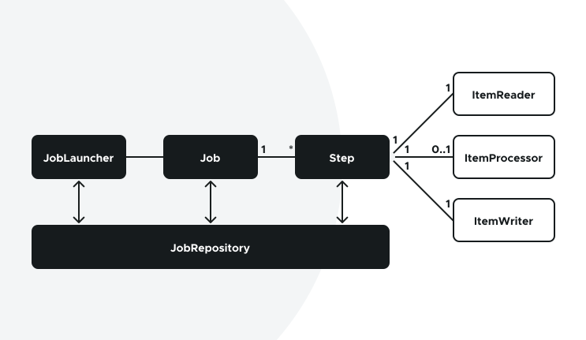
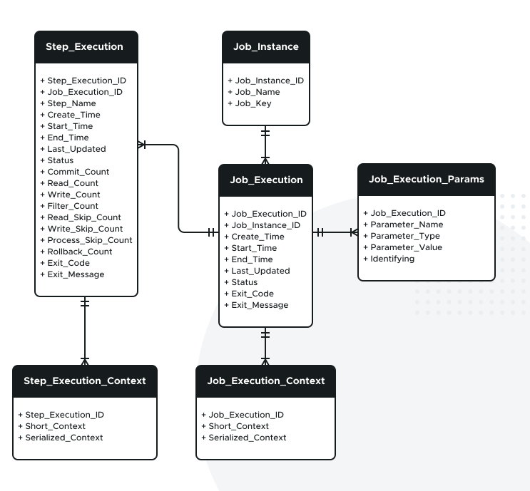
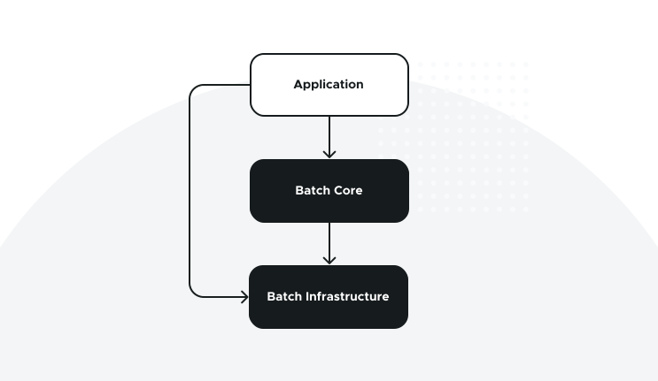
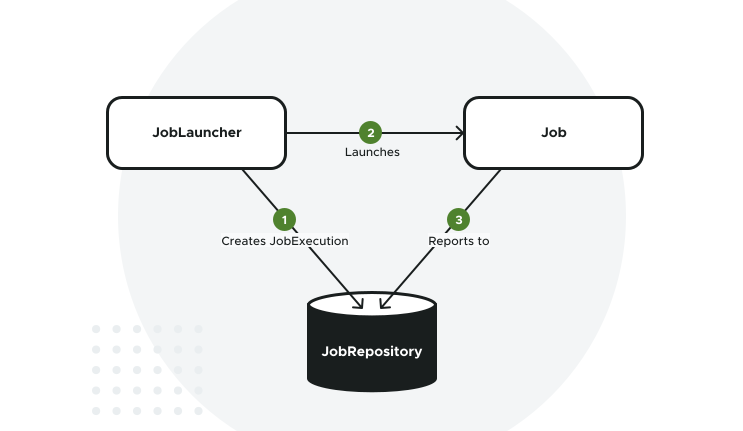
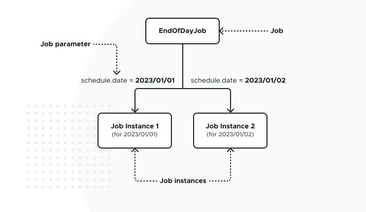
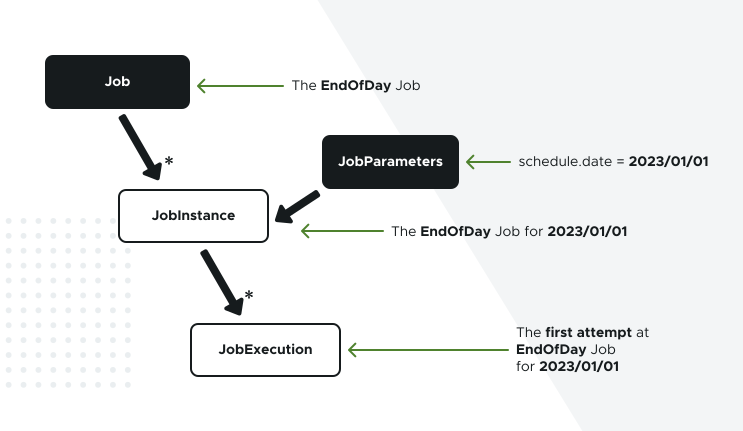
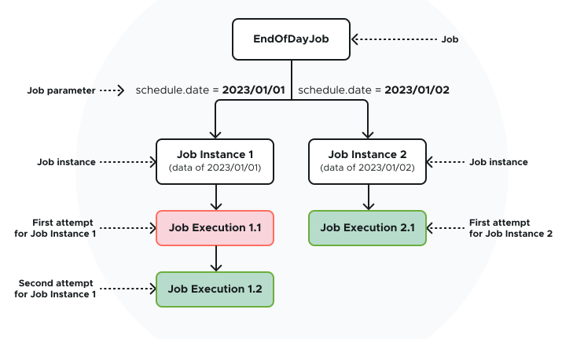

# [Building a Batch Application with Spring Batch](https://spring.academy/courses/building-a-batch-application-with-spring-batch)

Curso dictado por la misma página de Spring `Spring Academy`

---

# TEORÍA

---

## Introducción al procesamiento por lotes

El procesamiento por lotes es un método para procesar grandes volúmenes de datos simultáneamente, en lugar de
procesarlos individualmente, en tiempo real (en ese caso, podríamos hablar de procesamiento por flujos). Este método se
utiliza mucho en muchos sectores, como las finanzas, la fabricación y las telecomunicaciones. El procesamiento por lotes
suele utilizarse para tareas que requieren el tratamiento de grandes cantidades de datos, como el procesamiento de
nóminas o la facturación, así como para tareas que requieren cálculos o análisis que requieren mucho tiempo. **Las
aplicaciones por lotes son efímeras, lo que significa que una vez finalizadas, terminan.**

Este tipo de procesamiento conlleva una serie de retos, como por ejemplo

- Manejo eficiente de grandes cantidades de datos
- Tolerancia a errores humanos y deficiencias de hardware
- Escalabilidad

Cuando llega el momento de proporcionar una aplicación basada en lotes para procesar grandes cantidades de datos de
forma estructurada, Spring Batch proporciona una solución robusta y eficiente. Entonces, ¿qué es exactamente Spring
Batch? ¿Cómo ayuda a afrontar los retos del procesamiento por lotes?.

## Spring Batch Framework

Spring Batch es un framework ligero y completo, diseñado para permitir el desarrollo de aplicaciones por lotes robustas
que son vitales para las operaciones diarias de los sistemas empresariales.

Proporciona todas las funciones necesarias que son esenciales para procesar grandes volúmenes de datos, incluida la
gestión de transacciones, el estado de procesamiento de los trabajos, las estadísticas y las funciones de tolerancia a
fallos. También proporciona funciones avanzadas de escalabilidad que permiten realizar trabajos por lotes de alto
rendimiento mediante técnicas de procesamiento multihilo y partición de datos. Puede utilizar Spring Batch tanto en
casos de uso sencillos (como cargar un archivo en una base de datos) como en casos de uso complejos y de gran volumen (
como mover datos entre bases de datos, transformarlos, etc.).

Spring Batch se integra perfectamente con otras tecnologías Spring, lo que lo convierte en una excelente opción para
escribir aplicaciones por lotes con Spring.

## Lenguaje de dominio batch

Los conceptos clave del modelo de dominio Spring Batch se representan en el siguiente diagrama:



Un `Job` es una entidad que encapsula todo un proceso por lotes, que se ejecuta de principio a fin sin interrupción.
Un `Job` tiene uno o más `Steps`. Un `Step` es una unidad de trabajo que puede ser una tarea simple (como copiar un
fichero o crear un archivo), o una tarea orientada a ítems (como exportar registros de una tabla de base de datos
relacional a un fichero), en cuyo caso, tendría un `ItemReader`, un `ItemProcessor` (que es opcional), y
un `ItemWriter`.

Un `Job` necesita ser lanzado con un `JobLauncher`, y puede ser lanzado con un conjunto de `JobParameters`. Los
metadatos de ejecución sobre el `Job` que se está ejecutando se almacenan en un `JobRepository`.

Cubriremos cada uno de estos conceptos clave en detalle a lo largo del curso.

## Modelo de dominio por lote

Spring Batch utiliza un modelo robusto y bien diseñado para el dominio del procesamiento por lotes. Proporciona un rico
conjunto de APIs Java con interfaces y clases que representan todos los conceptos clave del procesamiento por lotes
como `Job, Step, JobLauncher, JobRepository`, y más. Utilizaremos estas API en este curso.

Aunque el modelo de dominio de lotes puede implementarse con cualquier tecnología de persistencia (como una base de
datos relacional, una base de datos no relacional, una base de datos gráfica, etc.), Spring Batch proporciona un modelo
relacional de los conceptos de dominio de lotes con tablas de metadatos que se ajustan estrechamente a las clases e
interfaces de la API de Java.

El siguiente diagrama entidad-relación presenta las principales tablas de metadatos:



- `Job_Instance`: Esta tabla contiene toda la información relevante para la definición de un `Job`, como el nombre
  del `Job` y su clave de identificación.

- `Job_Execution`: Esta tabla contiene toda la información relevante para la ejecución de un `Job`, como la hora de
  inicio, la hora de finalización y el estado. Cada vez que se ejecuta un `Job`, se inserta una nueva fila en esta
  tabla.

- `Job_Execution_Context`: Esta tabla contiene el contexto de ejecución de un `Job`. Un contexto de ejecución es un
  conjunto de pares clave/valor de información en tiempo de ejecución que suele representar el estado que debe
  recuperarse tras un fallo.

- `Step_Execution`: Esta tabla contiene toda la información relevante para la ejecución de un `step`, como la hora de
  inicio, la hora de finalización, el recuento de lectura de elementos y el recuento de escritura de elementos. Cada vez
  que se ejecuta un `step`, se inserta una nueva fila en esta tabla.

- `Step_Execution_Context`: Esta tabla contiene el contexto de ejecución de un `step`. Es similar a la tabla que
  contiene el contexto de ejecución de un `Job`, pero en su lugar almacena el contexto de ejecución de un `step`.

- `Job_Execution_Params`: Esta tabla contiene los parámetros de ejecución de un `Job`.

## Spring Batch Architecture

Spring Batch está diseñado de forma modular y extensible. En el diagrama siguiente se muestra la arquitectura en capas
que admite la facilidad de uso del framework para los usuarios finales:



Esta arquitectura en capas destaca tres componentes principales de alto nivel:

- La capa `Application`: contiene el `job` por lotes y el código personalizado escrito por los desarrolladores de la
  aplicación por lotes.

- La capa `Batch Core`: contiene las clases centrales de tiempo de ejecución proporcionadas por Spring Batch que son
  necesarias para crear y controlar los `jobs` por lotes. Incluye implementaciones para `Job` y `Step`, así como
  servicios comunes como `JobLauncher` y `JobRepository`.

- La capa `Batch Infrastructure`: contiene lectores y escritores de elementos comunes proporcionados por Spring Batch,
  además de servicios base como los mecanismos de repetición y reintento, que utilizan tanto los desarrolladores de
  aplicaciones como el propio marco central.

Como desarrollador de Spring Batch, normalmente utilizará las APIs proporcionadas por Spring Batch en los
módulos `Batch Infrastructure` y `Batch Core` para definir sus `jobs` y `steps` en la capa Application. Spring Batch
proporciona una amplia biblioteca de componentes de lotes que puede utilizar de forma inmediata (como lectores de
elementos, escritores de elementos, particionadores de datos, etc.).

---

# MODULE 1: Create, run and test your Job

---

## Entendiendo los Jobs y cómo ejecutarlos

En la lección anterior, aprendió que un `job` es una entidad que encapsula un proceso por lotes completo que se ejecuta
de principio a fin sin interacción ni interrupción. En esta lección, aprenderá cómo se representan internamente
los `jobs` en Spring Batch, cómo se lanzan y cómo se conservan sus metadatos de ejecución.

## ¿Qué es un Job?

Un `job` es una entidad que encapsula todo un proceso por lotes que se ejecuta de principio a fin. Consiste en un
conjunto de pasos que se ejecutan en un orden específico. Cubriremos los pasos en una lección futura. Aquí nos
centraremos en qué es un `job` y cómo se representa en Spring Batch.

Un `job` por lotes en Spring Batch está representado por la interfaz `Job` proporcionada por la dependencia
`spring-batch-core`:

````java
public interface Job {
    String getName();

    void execute(JobExecution execution);
}
````

En un nivel fundamental, la interfaz `Job` requiere que las implementaciones especifiquen el nombre del Job (el método
`getName()`) y lo que se supone que debe hacer el Job (el método `execute(JobExecution execution)`).

El método `execute` da una referencia a un objeto `JobExecution`. El objeto `JobExecution` **representa la ejecución
real del `Job` en tiempo de ejecución. Contiene una serie de detalles en tiempo de ejecución, como la hora de inicio,
la hora de finalización, el estado de ejecución, etc.** Esta información de tiempo de ejecución es almacenada por Spring
Batch en un repositorio de metadatos, que veremos en la siguiente sección.

Observe que no se espera que el método `execute` lance ninguna excepción. Las excepciones en tiempo de ejecución
deben ser gestionadas por las implementaciones, y añadidas en el objeto `JobExecution`. Los clientes deben inspeccionar
el estado de `JobExecution` para determinar el éxito o el fracaso.

## Entendiendo los metadatos del Job

Uno de los conceptos clave en Spring Batch es el `JobRepository`. El `JobRepository` es donde se almacenan todos los
metadatos sobre `jobs` y `steps`. Un `JobRepository` puede ser un almacén persistente o un almacén en memoria. Un
almacén persistente tiene la ventaja de proporcionar metadatos incluso después de que un `job` haya terminado, lo que
podría ser utilizado para el análisis posterior o para reiniciar un `job` en el caso de un fallo. Cubriremos la
posibilidad de reiniciar un `Job` en una lección posterior.

Spring Batch proporciona una implementación `JDBC` del `JobRepository`, que almacena metadatos de lotes en una base de
datos relacional. En un sistema de producción, deberá crear algunas tablas que Spring Batch utilizará para almacenar sus
metadatos de ejecución. Ya hemos tratado las tablas de metadatos en el Laboratorio anterior.

El `JobRepository` es lo que crea un objeto `JobExecution` cuando se lanza un trabajo por primera vez. Pero, **¿cómo se
lanzan los Trabajos?** Veámoslo en la siguiente sección.

## Lanzando Jobs

El lanzamiento de `jobs` en Spring Batch se realiza a través del concepto `JobLauncher`, representado por la siguiente
interfaz:

````java
public interface JobLauncher {
    JobExecution run(Job job, JobParameters jobParameters) throws
            JobExecutionAlreadyRunningException,
            JobRestartException,
            JobInstanceAlreadyCompleteException,
            JobParametersInvalidException;
}
````

El método `run` está diseñado para lanzar un `Job` dado con un conjunto de JobParameters. Cubriremos los parámetros del
`job` en detalle en una lección posterior. Por ahora, puedes pensar en ellos como una colección de pares clave/valor
que son pasados al `Job` en tiempo de ejecución. Hay dos aspectos importantes a entender aquí:

- Se espera que las implementaciones de la interfaz `JobLauncher` obtengan un `JobExecution` válido del `JobRepository`
  y ejecuten el `Job`.
- El método `run` lanza diferentes tipos de excepciones. Cubriremos todas estas excepciones en detalle durante el curso.

Casi nunca tendrá que implementar la interfaz `JobLauncher` usted mismo, porque Spring Batch proporciona una
implementación lista para usar. El siguiente diagrama muestra cómo el `JobLauncher`, el `JobRepository` y el `Job`
interactúan entre sí.



Los trabajos por lotes se lanzan normalmente de dos maneras:

- Desde la interfaz de línea de comandos.
- Desde un contenedor web.

**En este curso, sólo cubriremos el lanzamiento de `Jobs` desde la línea de comandos.** Por favor, consulte los
enlaces de recursos adicionales para más detalles sobre cómo lanzar trabajos desde dentro de un contenedor web.

---

## Entendiendo las instancias de Job

En la lección anterior, aprendiste sobre `Jobs` y `JobExecutions`. En esta lección, exploraremos otro concepto clave del
modelo de dominio Batch, que es `JobInstance`. Explicaremos qué son las `JobInstances` y cómo se relacionan con
los `Jobs` y las `JobExecutions`.

## ¿Qué son los Job Instances?

Un `job` puede definirse una vez, pero es probable que se ejecute muchas veces, normalmente según un calendario
establecido. En Spring Batch, un `job` es la definición genérica de un proceso por lotes especificado por un
desarrollador. Esta definición genérica debe parametrizarse para crear instancias reales de un `job`, denominadas
`JobInstances`.

**Un `JobInstance` es una parametrización única de una definición de Job.** Por ejemplo, imagine un proceso por lotes
que
necesita ser ejecutado una vez al final de cada día, o cuando un determinado archivo está presente. En el escenario de
una vez al día, podemos utilizar Spring Batch para crear un `Job` EndOfDay para ello. Habría una única definición de
`Job` EndOfDay, pero múltiples instancias de ese mismo `Job`, una por día. Cada instancia procesaría los datos de un
día en particular, y podría tener un resultado diferente (éxito o fracaso) de otras instancias. Por lo tanto, cada
instancia individual del `Job` debe ser rastreada por separado.

Un `JobInstance` se distingue de otros `JobInstances` por un parámetro específico, o un conjunto de parámetros. Por
ejemplo, un parámetro llamado **schedule.date** especificaría un día concreto. Dicho parámetro se
denomina `JobParameter`. Los `JobParameters` son los que distinguen un `JobInstance` de otra. El siguiente diagrama
muestra cómo los `JobParameters` definen las `JobInstances`:



## ¿Qué representan los Job Instances y los Job Parameters?

Los `JobInstances` se diferencian entre sí por distintos `JobParameters`. Estos parámetros suelen representar los datos
que
debe procesar un determinado `JobInstance`. Por ejemplo, en el caso del `Job` EndOfDay, el `Job parameter`
**schedule.date** para el 1 de enero define la instancia de job que procesará los datos del 1 de enero.
El `Job parameter` **schedule.date** para el 2 de enero define la instancia de job que procesará los datos del 2 de
enero, y así sucesivamente.

Aunque no es necesario que los `job parameters` representen los datos que se van a procesar, esta es una buena
sugerencia - y una buena práctica - para diseñar correctamente los `JobInstances`. Diseñar `JobInstances` que
representen los datos a procesar es más fácil de configurar, de probar y de pensar, en caso de fallo.

La definición de un `JobInstance` en sí no tiene absolutamente ninguna relación con los datos que se van a cargar.
Depende totalmente de la implementación del `Job` determinar cómo se cargan los datos, basándose en
los `Job parameters`. A continuación se muestran algunos ejemplos de `JobParameters` y cómo representan los datos que
debe procesar el `JobInstance` correspondiente:

- **Una fecha específica:** En este caso, tendríamos una JobInstance por fecha.
- **Un fichero concreto:** En este caso, tendríamos una JobInstance por fichero.
- **Un rango específico de registros en una tabla de base de datos relacional:** En este caso, tendríamos una
  JobInstance por rango.
- Y más.

Para nuestro curso, el `BillingJob` de Spring Cellular consume un archivo plano como entrada, que es un buen candidato
para ser pasado como un JobParameter a nuestro Job.

Esto es lo que veremos en el próximo laboratorio de esta lección.

## ¿Cómo se relacionan los Job Instance con los Job Execution?

**Un `JobExecution` se refiere al concepto técnico de un único intento de ejecutar un** `JobInstance`. Como se ha visto
en la lección anterior, un `JobExecution` puede terminar con éxito o con fracaso. En el caso del `Job` **EndOfDay**, si
la ejecución del 1 de Enero falla la primera vez y se ejecuta de nuevo al día siguiente, sigue siendo la ejecución del 1
de Enero. Por lo tanto, cada `JobInstance` puede tener múltiples `JobExecutions`.

La relación entre los conceptos de `Job, JobInstance, JobParameters y JobExecution` se resume en el siguiente diagrama:



He aquí un ejemplo concreto del ciclo de vida de un `JobInstance` en el caso del `Job EndOfDay`:



En este ejemplo, el primer intento de ejecución del `Job Instance 1` falla, por lo que se ejecuta otra ejecución
y tiene éxito. Esto da lugar a dos `JobExecutions` para la misma `JobInstance`. Para el `Job Instance 2`, sin
embargo, el primer intento de ejecución tiene éxito, por lo que no hay necesidad de lanzar una segunda ejecución.

**En Spring Batch, un `JobInstance` no se considera completo a menos que un `JobExecution` finalice con éxito.** Un
`JobInstance` que está completo no puede reiniciarse de nuevo. Se trata de una elección de diseño para evitar el
reprocesamiento accidental de los mismos datos para los `jobs` por lotes que no son idempotentes.

## Los distintos tipos de Job Parameters

Los `JobParameters` se utilizan normalmente para distinguir un `JobInstance` de otro. En otras palabras, se utilizan
para identificar un `JobInstance` específico.

No todos los parámetros pueden utilizarse para identificar `job instance`. Por ejemplo, si el `Job EndOfDay`
toma otro parámetro - digamos, **file.format**) - que representa el formato del archivo de salida (CSV, XML, y otros),
este parámetro no representa realmente los datos a procesar, por lo que, podría ser excluido del proceso de
identificación de los `Job Instances`.

Aquí es donde entran en juego los `JobParameters` **no identificadores**. En Spring Batch, los `JobParameters` pueden
ser identificadores o no identificadores. Un `JobParameter` identificativo contribuye a la identificación
de `JobInstance`, mientras que uno no identificativo no. Por defecto, los `JobParameters` son identificadores, y Spring
Batch proporciona API para especificar si un `JobParameter` es identificador o no.

En el ejemplo del `Job EndOfDay`, los parámetros se pueden definir en la siguiente tabla:

| Job parameters | Identifying? | Example    
|----------------|--------------|------------
| schedule.date  | yes          | 2023-01-01 
| file.format    | no           | csv        

Ahora la pregunta es: **¿Por qué es importante y cómo se utiliza en Spring Batch?** La identificación de `JobParameters`
juega un papel crucial en caso de fallo. En un entorno de producción, donde cientos de instancias de Job se están
ejecutando, y una de ellas falla, necesitamos una manera de identificar qué instancia ha fallado. Aquí es donde la
identificación de los parámetros del `Job` es clave. Cuando un `JobExecution` para un `JobInstance` dado falla, lanzar
el mismo job con el mismo conjunto de `JobParameters` de identificación creará un nuevo `JobExecution` (es decir, un
nuevo intento) para el mismo JobInstance.

En esta lección, ha aprendido qué son las JobInstances y cómo identificarlas con JobParameters. En el Laboratorio de
esta lección, aprenderá a utilizar las API proporcionadas por Spring Batch para manipular JobParameters, y cómo iniciar
el mismo o diferentes JobInstances.

---

## Testeando tu Job

Ya hemos visto cómo testear los `jobs` de Spring Batch utilizando `JUnit 5` y las utilidades de prueba de Spring Boot en
Laboratorios anteriores. En esta lección, `nos centraremos en las utilidades de prueba proporcionadas por Spring Batch`
en el módulo `spring-batch-test`, que está diseñado para simplificar la prueba de artefactos por lotes.

## Diferentes tipos de test para jobs por lotes

Cuando se trata de probar jobs por lotes, existen varios niveles de pruebas:

- **Probar el job de principio a fin:** En este escenario, una prueba debe proporcionar **los datos de entrada, ejecutar
  el trabajo y verificar el resultado final**. Podemos calificar este tipo de pruebas como pruebas de `caja negra`, en
  las que consideramos el trabajo como una caja negra que probamos en función de las entradas y salidas. Las pruebas de
  extremo a extremo es lo que hemos estado haciendo hasta ahora en este curso.


- **Probar cada paso del job individualmente:** En este escenario, un job por lotes complejo se define en un flujo
  de trabajo de pasos, y **probamos cada paso de forma aislada sin lanzar el trabajo completo.**

En ambos casos, es necesario configurar los datos de prueba y lanzar un job o un paso específico. Para ello, Spring
Batch proporciona la API `JobLauncherTestUtils`, **diseñada para lanzar jobs completos o steps individuales en las
pruebas.** `JobLauncherTestUtils` proporciona varias utilidades y métodos. Estos son los más importantes:

- **Generación aleatoria de parámetros de job:** esta función le permite generar un conjunto único de parámetros de
  job para tener instancias de job distintas durante las pruebas. Esto es particularmente útil para hacer sus
  pruebas repetibles, y sus construcciones idempotentes. De hecho, esto evita reiniciar las mismas instancias de job
  de nuevo a través de diferentes pruebas, lo que haría que algunas pruebas fallen. Estos métodos incluyen:

    - `JobLauncherTestUtils.getUniqueJobParameters`
    - `JobLauncherTestUtils.getUniqueJobParametersBuilder`


- **Lanzar un job completo de principio a fin:** `JobLauncherTestUtils.launchJob` te permite lanzar un job de la misma
  forma que lo lanzarías en producción. Tiene la opción de lanzarlo con un conjunto de parámetros de job generados
  aleatoriamente, o con un conjunto específico de parámetros.


- **Lanzamiento de un step individual:** `JobLauncherTestUtils.launchStep` le permite probar un paso aislado de otros
  pasos sin tener que lanzar el job que lo incluye.

Utilizaremos estas utilidades en el próximo Laboratorio de esta lección.

## Decisiones de bases de datos

## Compensaciones sobre el intercambio de bases de datos

## Utilidades de testing de Spring Batch

## Utilidades adicionales de test
